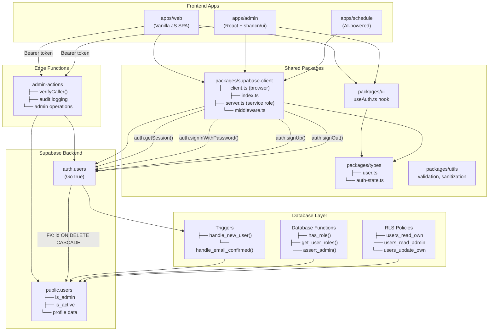
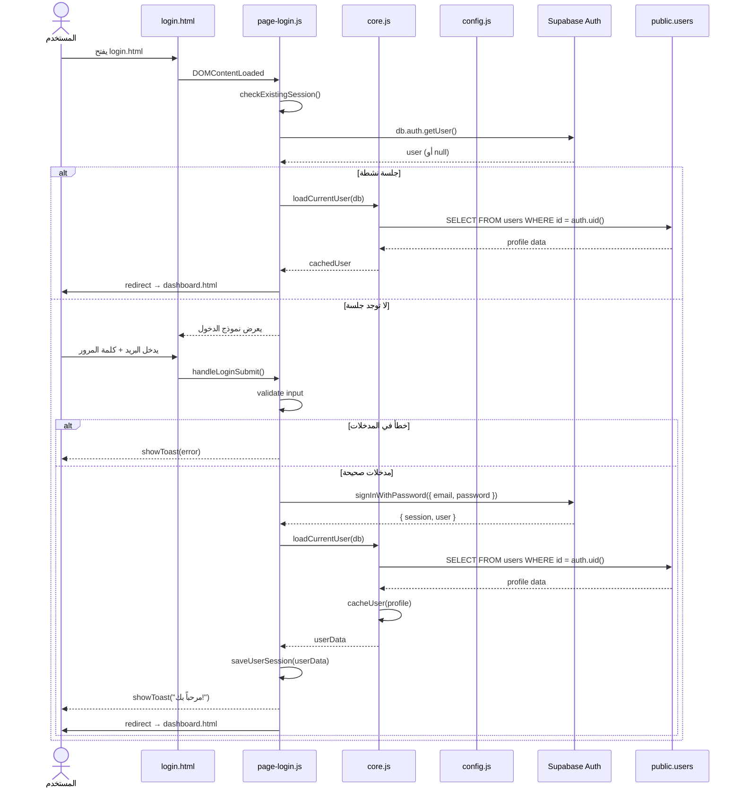
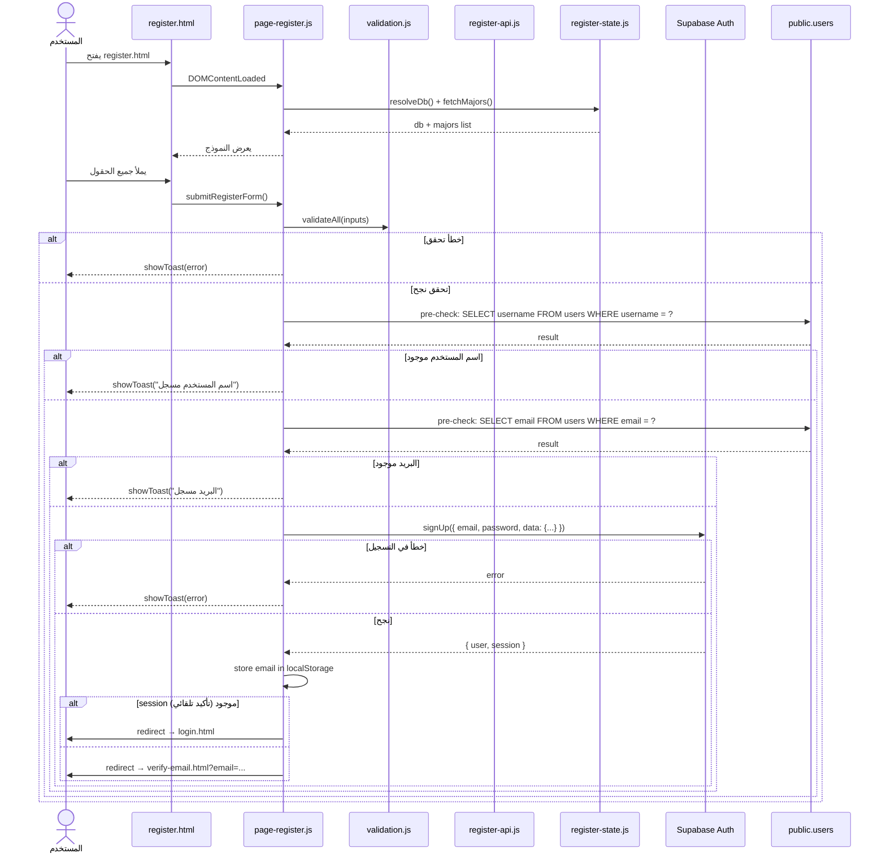
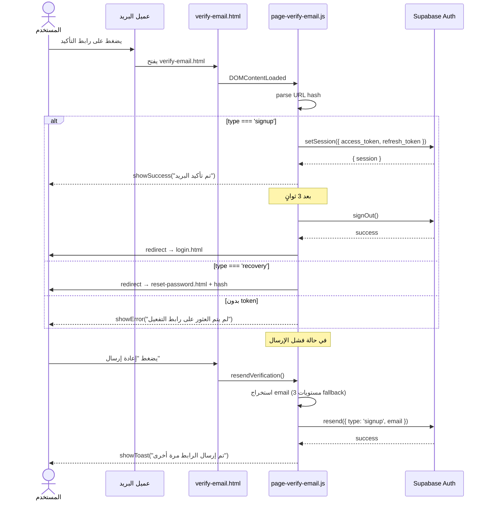
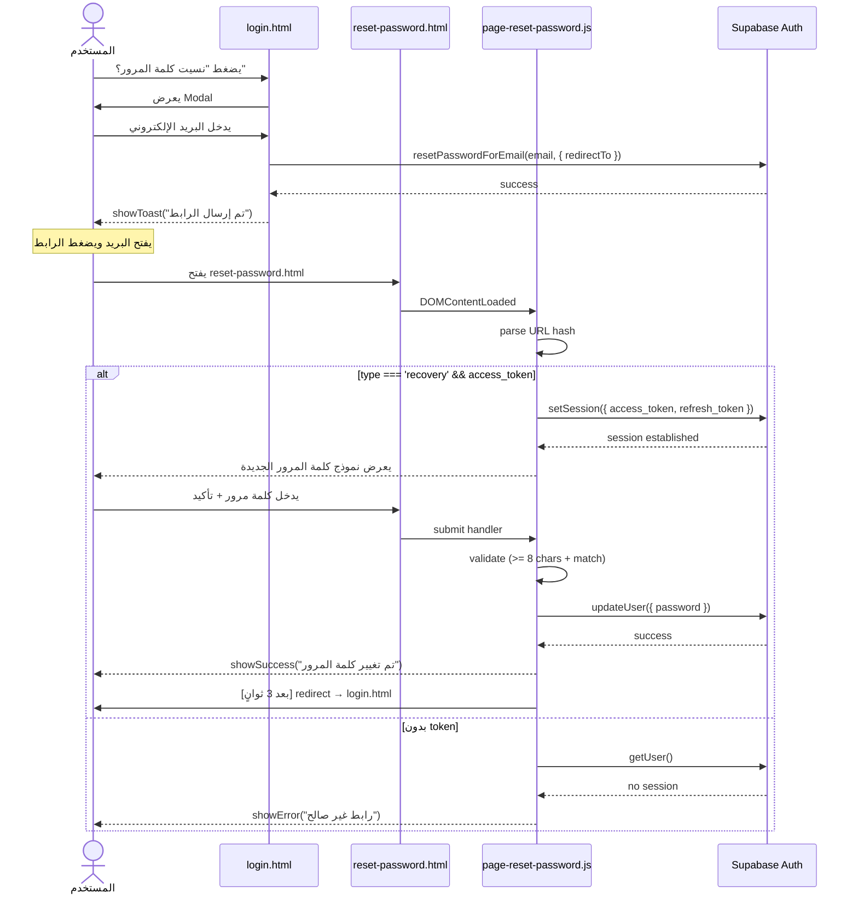
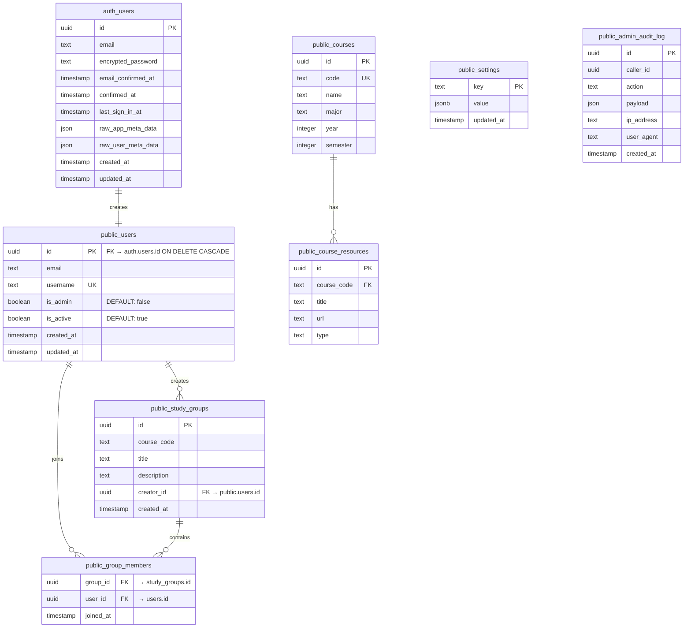
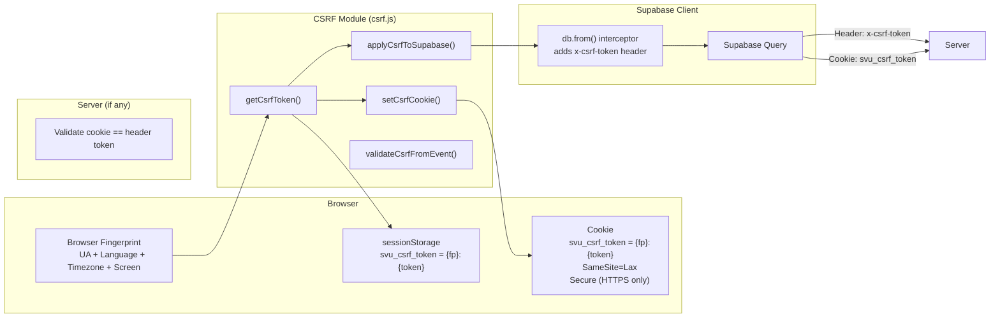
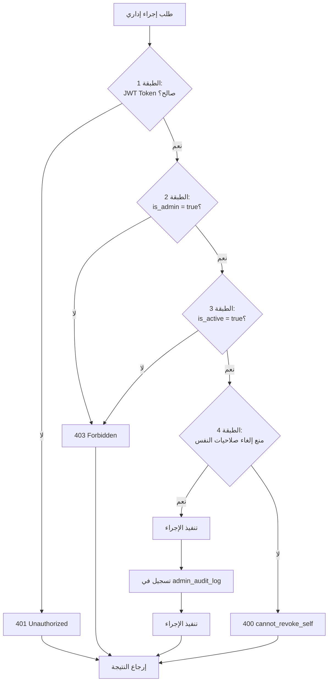
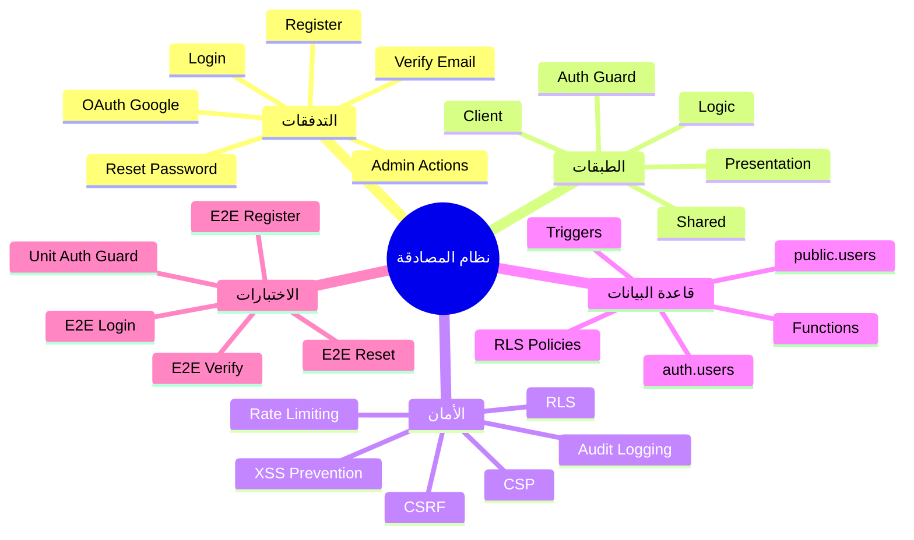

# مخططات علاقات نظام المصادقة - SVU Community

## 1. مخطط البنية العامة (System Architecture)



---

## 2. مخطط تدفق تسجيل الدخول (Login Flow)



---

## 3. مخطط تدفق التسجيل (Register Flow)



---

## 4. مخطط تدفق تأكيد البريد (Email Verification Flow)



---

## 5. مخطط تدفق إعادة تعيين كلمة المرور (Password Reset Flow)



---

## 6. مخطط تدفق المشرف (Admin Flow)

```mermaid
sequenceDiagram
    actor Admin as المشرف
    participant AdminPage as admin.html
    participant AdminAuth as admin/auth.js
    participant AdminAPI as adminApi.js
    participant EdgeFn as admin-actions (Edge Function)
    participant Supabase as Supabase (service role)
    participant DB as public.users

    Admin->>AdminPage: يفتح admin.html
    AdminPage->>AdminAuth: checkAdminAccess()

    AdminAuth->>AdminAuth: isLoggedIn()
    AdminAuth->>Supabase: verifySessionWithServer()
    Supabase-->>AdminAuth: isValid

    alt غير مصادق
        AdminAuth->>Admin: redirect → login.html
    else مصادق
        AdminAuth->>DB: SELECT is_admin, is_active FROM users WHERE id = ?
        DB-->>AdminAuth: { is_admin, is_active }

        alt ليس مشرف أو غير نشط
            AdminAuth-->>Admin: showAccessDenied()
            AdminAuth->>Admin: [بعد ثانيتين] redirect → index.html
        else مشرف ونشط
            AdminAuth-->>AdminPage: يعرض لوحة المشرف
        end
    end

    Note over AdminPage: ينفذ إجراء إداري
    Admin->>AdminPage: يضغط "تعيين مشرف"
    AdminPage->>AdminAPI: makeAdmin(userId)
    AdminAPI->>AdminAPI: validateUserId()
    AdminAPI->>AdminAPI: prevent self-action

    AdminAPI->>Supabase: getSession() → access_token
    Supabase-->>AdminAPI: { access_token }

    AdminAPI->>EdgeFn: functions.invoke('admin-actions', {
        headers: { Authorization: Bearer token },
        body: { action: 'makeAdmin', payload: { userId } }
    })

    EdgeFn->>EdgeFn: verifyCaller()
    EdgeFn->>Supabase: getUser(token)
    Supabase-->>EdgeFn: user
    EdgeFn->>DB: SELECT is_admin, is_active FROM users WHERE id = user.id
    DB-->>EdgeFn: profile

    alt غير مصرح
        EdgeFn-->>AdminAPI: 401/403 error
    else مصرح
        EdgeFn->>EdgeFn: log to admin_audit_log
        EdgeFn->>DB: UPDATE users SET is_admin = true WHERE id = userId
        DB-->>EdgeFn: success
        EdgeFn-->>AdminAPI: { ok: true }
        AdminAPI-->>Admin: showToast("تم التحديث")
    end
```

---

## 7. مخطط قاعدة البيانات (ER Diagram)



---

## 8. مخطط تدفق المصادقة الكامل (Complete Auth Flow)

```mermaid
flowchart TD
    Start([البداية: المستخدم يفتح التطبيق]) --> CheckDB{تم تهيئة<br/>Supabase؟}
    CheckDB -->|لا| Error1[عرض خطأ + redirect login]
    CheckDB -->|نعم| CheckSession{الجلسة<br/>نشطة؟}

    CheckSession -->|لا| ShowLogin[عرض نموذج تسجيل الدخول]
    CheckSession -->|نعم| LoadProfile[جلب الملف الشخصي من public.users]
    LoadProfile --> CheckActive{المستخدم<br/>نشط؟}
    CheckActive -->|لا| Deactivated[عرض "تم تعطيل الحساب"]
    CheckActive -->|نعم| CacheUser[تخزين المستخدم في الذاكرة]
    CacheUser --> CheckAdmin{مطلوب<br/>صلاحيات مشرف؟}
    CheckAdmin -->|لا| ShowDashboard[عرض لوحة التحكم]
    CheckAdmin -->|نعم| CheckAdminRole{is_admin<br/>= true؟}
    CheckAdminRole -->|لا| AccessDenied[عرض "غير مصرح"]
    CheckAdminRole -->|نعم| ShowAdmin[عرض لوحة المشرف]

    ShowLogin --> UserInputs[المستخدم يدخل البريد + كلمة المرور]
    UserInputs --> ValidateInput{مدخلات<br/>صحيحة؟}
    ValidateInput -->|لا| ShowError[عرض خطأ]
    ValidateInput -->|نعم| CallSignIn[call db.auth.signInWithPassword]

    CallSignIn --> SignInSuccess{نجح<br/>تسجيل الدخول؟}
    SignInSuccess -->|لا| ShowAuthError[عرض "البريد أو كلمة المرور غير صحيحة"]
    SignInSuccess -->|نعم| LoadProfile

    ShowError --> ShowLogin
    ShowAuthError --> ShowLogin

    Deactivated --> RedirectLogin[redirect → login.html]
    AccessDenied --> RedirectIndex[redirect → index.html]
    Error1 --> RedirectLogin
```

---

## 9. مخطط حماية CSRF (CSRF Protection Architecture)



---

## 10. مخطط أمان المشرف (Admin Security Layers)



---

## 11. مخطط الامتدادات (Extension Points)



---

## 12. ملخص التدفقات والعلاقات

### 12.1 تدفقات المصادقة الأساسية

```
┌────────────────────────────────────────────────────────────────────────────┐
│                           التدفقات الأساسية                                 │
├──────────────────┬─────────────────────────────────────────────────────────┤
│ التسجيل          │ register.html → validate → pre-check → signUp         │
│                  │ → [session? login.html : verify-email.html]          │
├──────────────────┼─────────────────────────────────────────────────────────┤
│ تأكيد البريد     │ verify-email.html → setSession → signOut → login    │
├──────────────────┼─────────────────────────────────────────────────────────┤
│ تسجيل الدخول     │ login.html → checkExistingSession →                     │
│                  │ signInWithPassword → loadCurrentUser → dashboard      │
├──────────────────┼─────────────────────────────────────────────────────────┤
│ إعادة التعيين    │ login.html → resetPasswordForEmail                    │
│                  │ → reset-password.html#token → setSession → updateUser │
├──────────────────┼─────────────────────────────────────────────────────────┤
│ Google OAuth     │ useAuth.ts → signInWithOAuth → redirect → callback    │
├──────────────────┼─────────────────────────────────────────────────────────┤
│ المشرف           │ admin.html → checkAdminAccess → admin-actions EF     │
│                  │ (JWT + role check + audit log)                        │
└──────────────────┴─────────────────────────────────────────────────────────┘
```

### 12.2 الفروقات بين التطبيقات

| العنصر | apps/web | apps/admin (React) | apps/schedule |
|--------|----------|-------------------|---------------|
| UI Framework | Vanilla JS + HTML | React 19 + shadcn/ui | React (AI-powered) |
| Auth Hook | window-shim + core.js | useAuth.ts | (يعتمد على web) |
| Admin Gate | admin/auth.js | App.tsx validateAccess | N/A |
| Session Storage | sessionStorage | React state + SDK | N/A |
| CSRF | مخصص (csrf.js) | وارث من supabase-client | N/A |

### 12.3 أسباب استخدام كل تقنية

| التقنية | السبب |
|----------|--------|
| Supabase Auth | توفير مصادقة مُدارة مع JWT + تحديث تلقائي |
| sessionStorage | أفضل من localStorage للجلسات (تُنظف عند إغلاق المتصفح) |
| RLS Policies | حماية على مستوى قاعدة البيانات حتى لو تم تجاوز العميل |
| SECURITY DEFINER | تنفيذ دوال صلاحيات بأمان في DB |
| CSRF double-submit | حماية إضافية ضد CSRF مع fingerprint binding |
| CSP headers | منع حقن نصوص ضارة |
| escapeHtml() | منع XSS في إخراج البيانات |
| Sentry redaction | منع تسرب بيانات حساسة في تتبع الأخطاء |
| handle_email_confirmed trigger | إنشاء ملف مستخدم فقط بعد تأكيد البريد |
