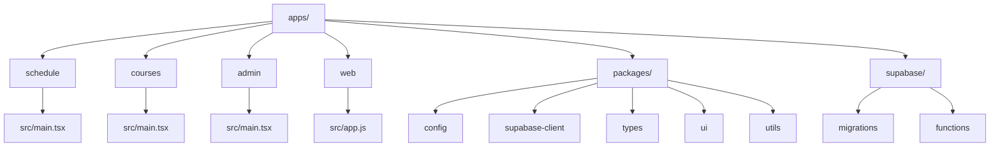

# SVU Community — Project Overview

Level 1: `apps/` (frontend applications)
- apps/admin
- apps/courses
- apps/schedule
- apps/web

Level 2: each app’s `src/main.tsx` (entry point)
- apps/schedule/src/main.tsx
- apps/courses/src/main.tsx
- apps/admin/src/main.tsx
- apps/web/src/app.js

Supporting:
- packages/ (shared libraries: config, supabase-client, types, ui, utils)
- supabase/ (migrations + edge functions)
- docs/ (architecture, API, guides)

