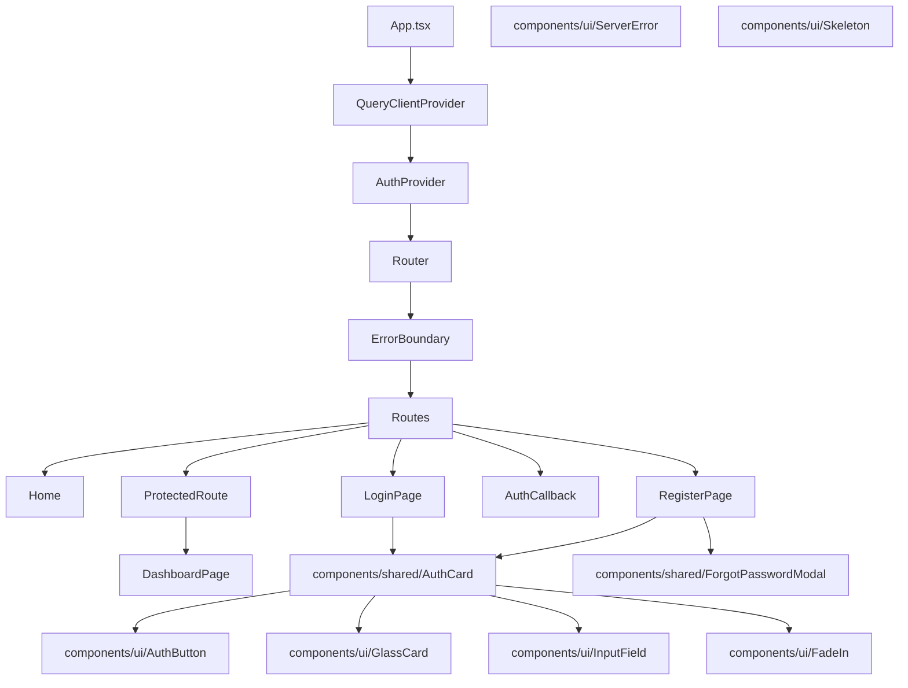

# Component Tree

```mermaid
graph TD
    App["App.tsx"]
    QCP["QueryClientProvider"]
    Auth["AuthProvider"]
    Router["Router"]
    ErrorBoundary["ErrorBoundary"]
    Routes["Routes"]

    Home["Home"]
    Login["LoginPage"]
    Register["RegisterPage"]
    AuthCallback["AuthCallback"]
    Protected["ProtectedRoute"]
    Dashboard["DashboardPage"]

    AuthCard["components/shared/AuthCard"]
    ForgotPW["components/shared/ForgotPasswordModal"]

    AuthBtn["components/ui/AuthButton"]
    FadeIn["components/ui/FadeIn"]
    GlassCard["components/ui/GlassCard"]
    InputField["components/ui/InputField"]
    ServerError["components/ui/ServerError"]
    Skeleton["components/ui/Skeleton"]

    App --> QCP
    QCP --> Auth
    Auth --> Router
    Router --> ErrorBoundary
    ErrorBoundary --> Routes

    Routes --> Home
    Routes --> Login
    Routes --> Register
    Routes --> AuthCallback
    Routes --> Protected
    Protected --> Dashboard

    Login --> AuthCard
    Register --> AuthCard
    AuthCard --> AuthBtn
    AuthCard --> GlassCard
    AuthCard --> InputField
    AuthCard --> FadeIn
    Register --> ForgotPW
```
