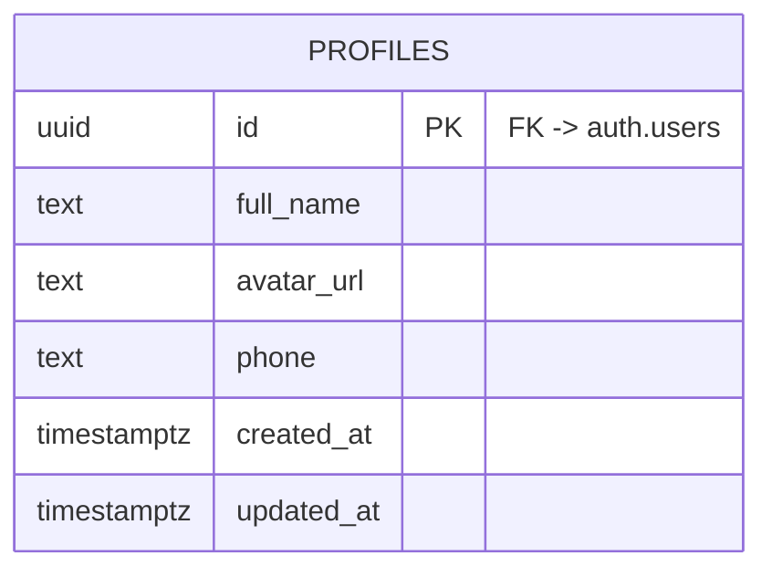

# ERD

> **Note:** `courses` and `groups` tables are not referenced anywhere in `untitled/src/` and are intentionally omitted from this diagram. If they are introduced later, they can be added as placeholder entities.
