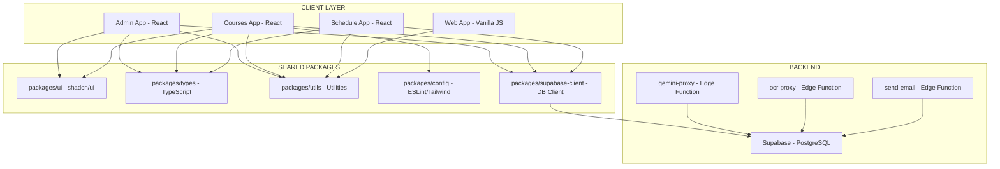
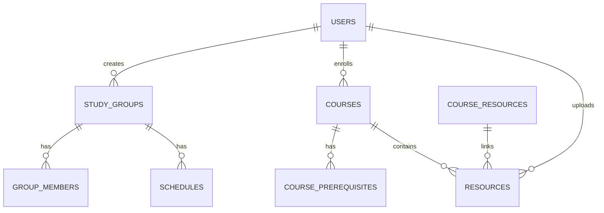

# 📋 خطة العمل - مشروع SVU Community v3.0.0_cleantree

> **تاريخ الإنشاء:** 2026-06-11  
> **الحالة:** 🚧 قيد التنفيذ  
> **المسؤول:** فريق التطوير  

---

## 📊 القسم 1.0 — الوضع الحالي للمشروع (Current State Assessment)

### 1.1 ملخص تنفيذي

المشروع في **مرحلة هيكلية أولية (Structural Scaffolding)**. البنية Monorepo مُنشأة بالكامل باستخدام npm Workspaces + Turborepo، لكن **104 من أصل 286 ملفاً فارغ تماماً (0 بايت)**. ثلاثة تطبيقات React (`admin`, `courses`, `schedule`) وتطبيق Vanilla JS (`web`) تم إنشاء هيكلها لكن بدون تبعيات (dependencies) أو محتوى وظيفي في معظمها.

**حالة المشروع: ⚠️ غير قابل للتشغيل حالياً.**

---

### 1.2 إحصائيات المشروع

| المقياس | العدد |
|---------|-------|
| إجمالي الملفات | 286 |
| ملفات فارغة تماماً (0 بايت) | **104** |
| ملفات ذات محتوى حقيقي | ~50 |
| ملفات علايقة/Config | 132 |
| تطبيقات (apps) | 4 |
| حزم مشتركة (packages) | 5 |
| ملفات ترحيل Supabase | 7 |
| ملفات بذرة (seed) | 3 |
| وظائف Edge (Edge Functions) | 3 |
| ملفات CI/CD | 4 |
| ملفات توثيق | 10 |

---

### 1.3 الوضع الحالي حسب القسم

#### 1.3.1 التطبيقات (Apps)

| التطبيق | الملفات | فارغة | ذات محتوى | الحالة |
|---------|---------|-------|-----------|--------|
| `apps/admin` | 10 | 6 | 4 | ⚠️ هيكل فقط — 4 ملفات فارغة |
| `apps/courses` | 34 | 12 | 22 | 🟡 أفضل التطبيقات — interactive map مكتمل |
| `apps/schedule` | 14 | 10 | 4 | 🔴 هيكل فقط — 10 ملفات فارغة |
| `apps/web` (قديم) | 16 | 0 | 16 | 🟡 JS vanilla — يحتاج تطوير |

**التفاصيل:**

- **apps/admin**: 4 ملفات ذات محتوى (`App.tsx`, `main.tsx`, `AdminLayout.tsx`, `index.html`) لكن `package.json` بدون تبعيات. 6 ملفات فارغة: `api.ts`, `Sidebar.tsx`, `CourseManager.tsx`, `StatsCard.tsx`, `SettingsPanel.tsx`, `UserTable.tsx`.

- **apps/courses**: أفضل تطبيق من حيث المحتوى. يحتوي على:
  - ✅ `InteractiveMap.tsx` + `CourseNode.tsx` + `courseUtils.ts` + `layoutUtils.ts` + `ite_data.ts` (~700 سطر منطق فعلي)
  - ✅ `course-modal/index.tsx` (270 سطر)
  - ✅ `App.tsx` (130 سطر واجهة عربية)
  - ⚠️ 12 ملف فارغ (auth, courses features, groups, shared)
  - ⚠️ `errorsBoundary/index.tsx` (111 سطر) لكن قد يحتاج مراجعة

- **apps/schedule**: 10 ملفات فارغة من 14 ملف. هيكل التطبيق مُنشأ لكن بدون أي منطق تنفيذي.

- **apps/web**: تطبيق JS vanilla الأقدم. جميع 16 ملف لها محتوى لكن الميزات غير مكتملة:
  - `auth.js`: يحتاج تنفيذ auth guard
  - `helpers.js`: يحتاج تنفيذ router
  - لا توجد صفحات كثيرة

---

#### 1.3.2 الحزم المشتركة (Packages)

| الحزمة | package.json | tsconfig.json | المحتوى | الحالة |
|--------|-------------|---------------|---------|--------|
| `packages/config` | 🔴 فارغ | 🔴 فارغ | 1 ملف (vite/index.js خاطئ الاسم) | 🔴 **يُوقف npm workspace** |
| `packages/supabase-client` | 🔴 فارغ | — | 1 ملف فقط (`client.ts`的张Ÿ) | 🔴 **يُوقف npm workspace** |
| `packages/types` | 🔴 فارغ | 🔴 فارغ | جميعها فارغة | 🔴 **يُوقف npm workspace** |
| `packages/ui` | 🟡 موجود | 🔴 فارغ | 55 component UI مكتمل + 9 فارغ | 🟡 شبه مكتمل |
| `packages/utils` | 🔴 فارغ | 🔴 فارغ | كلها فارغة | 🔴 **يُوقف npm workspace** |

⚠️ **4 حزم من أصل 5 لها package.json فارغ.** هذا يعني `npm install` سيفشل فوراً.

---

#### 1.3.3 Supabase Layer

| القسم | الملفات | الحالة |
|-------|---------|--------|
| `supabase/config.toml` | 1 | 🔴 فارغ — CLI لا يعمل |
| `supabase/migrations/` | 7 | 🔴 كلها فارغة — لا جداول، لا RLS |
| `supabase/seed/` | 3 | 🔴 كلها فارغة — لا بيانات أولية |
| `supabase/functions/gemini-proxy/` | 3 | 🔴 فارغ |
| `supabase/functions/ocr-proxy/` | 2 | 🔴 فارغ |
| `supabase/functions/send-email/` | 2 | 🔴 فارغ |
| `packages/supabase-client/src/client.ts` | 1 | ✅ الكود الوحيد الصالح (17 سطر) |

---

#### 1.3.4 CI/CD

| الملف | الحالة |
|-------|--------|
| `.github/workflows/ci.yml` | 🔴 فارغ |
| `.github/workflows/deploy-courses.yml` | 🔴 فارغ |
| `.github/workflows/deploy-schedule.yml` | 🔴 فارغ |
| `.github/workflows/deploy-web.yml` | 🔴 فارغ |

لا توجد أي أنابيب CI/CD مُفعلة.

---

#### 1.3.5 التوثيق (Docs)

| الملف | الحالة |
|-------|--------|
| `docs/architecture/*.md` (3) | 🔴 فارغة |
| `docs/api/*.md` (3) | 🔴 فارغة |
| `docs/guides/*.md` (3) | 🔴 فارغة |
| `docs/README.md` | 🔴 فارغ |

لا يوجد توثيق واحد مكتمل.

---

### 1.4 الأخطاء الفادحة (Fatal Errors — تمنع تشغيل المشروع)

| # | الملف / المنطقة | الخطأ | الأثر |
|---|---------------|-------|-------|
| F1 | `packages/*/package.json` (4 ملفات) | فارغ = JSON غير صالح | `npm install` يفشل فوراً |
| F2 | جميع `apps/*/package.json` | بدون `dependencies` | لا يمكن تثبيت React/Vite/TS |
| F3 | `supabase/migrations/` (7 ملفات) | فارغة | قاعدة البيانات بدون جداول |
| F4 | `supabase/functions/` (3 دوال) | فارغة | Gemini/OCR/Email لا تعمل |
| F5 | `apps/web/vite.config.js` | ESM import بدون `type:module` | Node يفشل في قراءة الـ config |
| F6 | `.gitignore` | لا يتجاهل `.env` | خطر تسريب أسرار |
| F7 | `packages/config/eslint/index.js` | فارغ | `npm run lint` يفشل |
| F8 | `apps/courses/package.json` | `tsc -b` بدون `composite` | build يفشل |

---

### 1.5 أخطاء الأمان (Security Issues)

| # | الملف | المشكلة | الخطورة |
|---|-------|---------|---------|
| S1 | `.env.example` | `SUPABASE_SERVICE_ROLE_KEY` بدون تحذير استخدم client-side | 🟡 متوسط |
| S2 | `.gitignore` | `.env` غير متجاهل — خطر تسريب مفاتيح | 🔴 عالي |
| S3 | `supabase/migrations/` | لا توجد RLS policies — كل الجداول مفتوحة | 🔴 عالي |
| S4 | `supabase/functions/` | 3 دوال فارغة — لا token validation ولا rate limiting | 🔴 عالي |
| S5 | `packages/supabase-client/src/client.ts` | يرمي Exception عند تحميل الوحدة — يوقف SSR | 🟡 متوسط |

---

### 1.6 جودة الكود (Code Quality Issues)

| # | الملف | المشكلة |
|---|-------|---------|
| Q1 | `turbo.json` | `lint` معتمد على `build` — يبطئ دورة التطوير |
| Q2 | `turbo.json` | `test` معتمد على `build` — unit tests لا تحتاج build |
| Q3 | Root `package.json` | كل devDependencies على `"latest"` — توقف CI محتمل |
| Q4 | `CODEOWNERS` | `@svu-community/core` غير موجود — مراجعات PR ستفشل |
| Q5 | `apps/courses/src/features/courses/api/courses.ts` | يكرر منطق `interactive-map/lib/courseUtils.ts` |
| Q6 | `packages/config/vite/index.js` | اسم خاطئ: يصدّر Vitest config وليس Vite config |
| Q7 | `packages/ui/styles/globals.css` | فارغ — لا CSS أساسي |
| Q8 | `packages/ui/src/index.ts` | فارغ — لا exports من المكتبة |

---

### 1.7 الأجزاء الصالحة القابلة للاستخدام الفوري

| المسار | السطور | الحالة |
|--------|--------|--------|
| `packages/ui/src/components/ui/*` | ~3,500 | ✅ جميع مكونات shadcn/ui مكتملة |
| `apps/courses/src/components/interactive-map/` | ~700 | ✅ InteractiveMap مع ReactFlow + dagre |
| `apps/courses/src/components/course-modal/` | 270 | ✅ بحث وفلترة وvalidation |
| `apps/courses/src/components/ErrorBoundary/` | 111 | ✅ مع تقرير أخطاء |
| `apps/courses/src/App.tsx` | 130 | ✅ واجهة عربية كاملة |
| `apps/courses/src/features/courses/api/courses.ts` | 148 | ✅ منطق مقررات (يحتاج توحيد) |
| `packages/ui/src/utils/cn.ts` | 6 | ✅ clsx + tailwind-merge |
| `packages/ui/src/utils/cn.js` | 6 | ✅ نسخة JS |
| `packages/supabase-client/src/client.ts` | 17 | ✅ عميل Supabase صالح |
| `archefe/ui/*` | 50 ملف | ✅ مكونات UI إضافية |

---

## 🔧 القسم 2.0 — المراحل الثمانية للعمل (Implementation Phases)

---

### 🔩 المرحلة 1: إصلاح الأخطاء المكتوبة في المشروع (Fix Known Errors)

**الهدف:** إصلاح جميع الأخطاء التي تمنع تشغيل المشروع (Fatal Errors F1–F8)

**المدة التقديرية:** 1–2 يوم عمل

**نوع العمل:** `edit` — تعديل ملفات موجودة فقط، لا إنشاء ملفات جديدة

#### المهام التفصيلية:

| # | المهمة | الملفات المتأثرة | الأثر |
|---|-------|----------------|------|
| 1.1 | إصلاح `package.json` الفارغة في 4 حزم | `packages/config/package.json`, `packages/supabase-client/package.json`, `packages/types/package.json`, `packages/utils/package.json` | يسمح `npm install` بالعمل |
| 1.2 | إضافة `dependencies` و `devDependencies` لجميع التطبيقات | 4 × `apps/*/package.json` | يسمح تشغيل التطبيقات |
| 1.3 | إصلاح `apps/web/vite.config.js` | إما تحويل إلى `.mjs` أو إضافة `"type":"module"` | Node يقرأ الـ config |
| 1.4 | إضافة `.env` إلى `.gitignore` | `.gitignore` | أمان |
| 1.5 | إصلاح `apps/courses/package.json` build script | إزالة `-b` أو إضافة `composite` | build يعمل |
| 1.6 | إضافة تحذير أمني في `.env.example` | `.env.example` | أمان |
| 1.7 | تصحيح `CODEOWNERS` | `CODEOWNERS` | مراجعات PR تعمل |
| 1.8 | إصلاح `packages/config/vite/index.js` (اسم) | إما نقل أو إعادة تسمية | وضوح |
| 1.9 | تحويل `latest` إلى إصدارات ثابتة في root | `package.json` | استقرار CI |
| 1.10 | إضافة `tsconfig.json` لـ `packages/ui` | `packages/ui/tsconfig.json` | TypeScript يعمل |
| 1.11 | إضافة `composite: true` لـ `tsconfig.json` في الحزم | 3 حزم tsconfig | `tsc -b` يعمل |

#### نتائج المرحلة 1 Deliverables:
- ✅ `npm install` يعمل بدون أخطاء
- ✅ `npm run build` يعمل لكل التطبيقات
- ✅ `.gitignore` يحتوي على `.env`
- ✅ 11 مهمة مكتملة

---

### ✅ المرحلة 2: تأكيد الإصلاحات وضمان عدم وجود أخطاء (Verify Fixes)

**الهدف:** التأكد من أن كل إصلاح يعمل فعلاً ولا توجد أخطاء مخفية

**المدة التقديرية:** ½–1 يوم عمل

#### المهام التفصيلية:

| # | المهمة |الأداة |
|---|-------|------|
| 2.1 | تشغيل `npm install` في جذر المشروع والتأكد من نجاحه | npm |
| 2.2 | تشغيل `npm run build` لكل تطبيق على حدة | turborepo |
| 2.3 | تشغيل `npx tsc --noEmit` لكل تطبيق | TypeScript compiler |
| 2.4 | تشغيل ESLint على كل `src/**/*.{ts,tsx}` | ESLint |
| 2.5 | التحقق من صحة all importsResolution | Module resolution check |
| 2.6 | التأكد من عدم وجود circular dependencies | madge / dependency-cruiser |
| 2.7 | فحص `turbo.json` pipeline | Manual review |

#### نتائج المرحلة 2 Deliverables:
- ✅ تقرير فحص كامل بدون أخطاء
- ✅ رسم بياني للتبعيات (dependency graph) بدون دورات

---

### 📦 المرحلة 3: نقل واعتماد الملفات الجاهزة من المشروع القديم (Port Reusable Files)

**الهدف:** نقل الملفات المكتملة الموجودة في المشروع القديم (التي تعمل بالفعل) وضمان صحتها

**المدة التقديرية:** 2–4 أيام عمل

#### المهام التفصيلية:

| # | الملف المصدر (قديم) | الملف الهدف (جديد) | الحالة |
|---|---------------------|-------------------|--------|
| 3.1 | مكونات auth كاملة | `apps/courses/src/features/auth/*` | 🚧 تحتاج تحديد |
| 3.2 | مكونات courses/cards | `apps/courses/src/features/courses/components/CourseCard.tsx` | 🚧 تحتاج تحديد |
| 3.3 | مكونات shared (Header, Sidebar) | `apps/courses/src/shared/components/` | 🚧 تحتاج تحديد |
| 3.4 | hooks (useTheme, useAuth) | `packages/ui/src/hooks/` | 🚧 تحتاج تحديد |
| 3.5 | utilities (helpers, formatters) | `packages/utils/src/` | 🚧 تحتاج تحديد |
| 3.6 | TypeScript types | `packages/types/src/` | 🚧 تحتاج تحديد |
| 3.7 | مكونات schedule (Calendar, Grid) | `apps/schedule/src/shared/` + `features/` | 🚧 تحتاج تحديد |
| 3.8 | مكونات admin (Table, StatsCard) | `apps/admin/src/features/` | 🚧 تحتاج تحديد |
| 3.9 | scripts (migrate, seed, deploy) | `scripts/*.sh` | 🚧 تحتاج كتابة |

#### لكل ملف منقول:
1. فحص Syntax (tsc / ESLint)
2. فحص Imports وتصحيح المسارات
3. فحص security (لا أسرار hardcoded)
4. فحص جودة الكود (naming, structure)
5. كتابة اختبارات أساسية

#### نتائج المرحلة 3 Deliverables:
- ✅ قائمة الملفات المنقولة مع تقرير فحص لكل ملف
- ✅ جميع Imports مُصححة
- ✅ 0 أخطاء Syntax

---

### 🏗️ المرحلة 4: تحديد الملفات المتبقية التي تحتاج إنشاء من الصفر (Identify Missing Files)

**الهدف:** تحديد الملفات التي لا توجد في المشروع القديم ولا يمكن نقلها، وتحتاج بناء من الصفر

**المدة التقديرية:** ½ يوم عمل

#### المهام التفصيلية:

| # | الفئة | الملفات المفقودة | الأولوية |
|---|-------|-------------------|---------|
| 4.1 | `packages/config` | `tsconfig/base.json`, `tsconfig/node.json`, `tsconfig/react.json`, `eslint/index.js` | 🔴 عالي |
| 4.2 | `packages/supabase-client` | `src/server.ts`, `src/middleware.ts`, `src/index.ts` (barrel) | 🔴 عالي |
| 4.3 | `packages/supabase-client` | `README.md` | 🟡 متوسط |
| 4.4 | `packages/types` | كل أنواع TypeScript (course, group, user, index) | 🔴 عالي |
| 4.5 | `packages/utils` | `date/formatters.ts`, `storage/index.ts`, `validation/validators.ts` | 🟡 متوسط |
| 4.6 | `packages/ui` | `styles/globals.css`, `utils/helpers.ts`, `index.ts` (barrel) | 🟡 متوسط |
| 4.7 | `packages/ui` | اختبارات Button/Card/Input | 🟢 منخفض |
| 4.8 | `supabase/config.toml` | إعداد المشروع والـ project ref | 🔴 عالي |
| 4.9 | `supabase/migrations/` | 7 ملفات SQL كاملة | 🔴 عالي |
| 4.10 | `supabase/seed/` | 3 ملفات seed | 🟡 متوسط |
| 4.11 | `supabase/functions/` | 3 دوال Edge كاملة | 🔴 عالي |
| 4.12 | `.github/workflows/` | 4 ملفات CI/CD | 🔴 عالي |
| 4.13 | `docs/` | 10 ملفات توثيق | 🟡 متوسط |
| 4.14 | `apps/admin` | 6 ملفات تنفيذية | 🔴 عالي |
| 4.15 | `apps/schedule` | 10 ملفات تنفيذية | 🔴 عالي |
| 4.16 | `scripts/` | 5 shell scripts | 🟡 متوسط |

#### تقرير المرحلة 4 Deliverables:
- ✅ قائمة كاملة بالملفات المفقودة مع الأولوية
- ✅ تقدير ساعات العمل لكل ملف
- ✅ خريطة التبعيات لكل ملف مفقود

---

### 🔍 المرحلة 5: فحص كامل للمشروع (Complete Project Audit)

**الهدف:** عمل فحص شامل لكن بدون تعديل — فقط تقرير

**المدة التقديرية:** 1 يوم عمل

#### المهام التفصيلية:

| # | المهمة | النطاق |
|---|-------|--------|
| 5.1 | قراءة كل ملف `.ts`, `.tsx`, `.js` في المشروع | 100+ ملف |
| 5.2 | فحص كل Import و Export | كل ملفات src |
| 5.3 | فحص كل path alias (`@/`, `@shared`, `@utils`, `@types`, `@supabase`) | tsconfig.json × 4 |
| 5.4 | فحص كل Vite config | 4 تطبيقات |
| 5.5 | فحص package.json لكل تطبيق وحزمة | 9 ملفات |
| 5.6 | فحص أمني شامل | كل الملفات |
| 5.7 | فحص .env.example مقابل الكود الفعلي | كل الخدمات |
| 5.8 | فحص عدم وجود أسرار مكشوفة | كل الملفات |
| 5.9 | التحقق من توافق الأيقونات/الخطوط العربية | styles/ |
| 5.10 | فحص تبعيات Circular | كل المشروع |

#### نتائج المرحلة 5 Deliverables:
- ✅ تقرير فحص كامل (Audit Report)
- ✅ قائمة تامة بالأخطاء المكتشفة مع المواقع والخطورة
- ✅ خطة إصلاح لكل خطأ

---

### 🔧 المرحلة 6: إصلاح المشاكل المكتشفة (Fix Discovered Issues)

**الهدف:** إصلاح جميع المشاكل التي تم العثور عليها في المرحلة 5

**المدة التقديرية:** 2–4 أيام عمل (حسب عدد المشاكل)

#### المهام التفصيلية:

| # | الفئة | المهام |
|---|-------|-------|
| 6.1 | Errors | إصلاح جميع أخطاء Syntax و TypeScript |
| 6.2 | Imports | إصلاح جميع المسارات والتبعيات المعطلة |
| 6.3 | Configs | إكمال ملفات config الناقصة (tsconfig, eslint, tailwind) |
| 6.4 | Package Management | إكمال package.json و dependencies للحزم الأربع |
| 6.5 | Supabase | إصلاح مسارات الاستيراد والعميل |
| 6.6 | Security | إصلاح جميع الثغرات الأمنية المكتشفة |
| 6.7 | Dependencies | إضافة/تحديث التبعيات المفقودة |
| 6.8 | Cross-cutting | توحيد المنطق المكرر (duplicate logic) |

#### نتائج المرحلة 6 Deliverables:
- ✅ `npm run build` يعمل بدون أخطاء لجميع التطبيقات
- ✅ `npm run lint` يعمل بدون أخطاء
- ✅ `tsc --noEmit` بدون أخطاء
- ✅ لا يوجد circular dependencies

---

### 🧪 المرحلة 7: الاختبارات والفحوصات (Testing & Quality Assurance)

**الهدف:** ضمان جودة عالية وموثوقية كاملة

**المدة التقديرية:** 2–3 أيام عمل

#### 7.1 اختبارات الجودة (Code Quality Tests)

| # | الاختبار | الأداة | الهدف |
|---|---------|--------|-------|
| 7.1.1 | Linting | ESLint | 0 أخطاء |
| 7.1.2 | Type Checking | `tsc --noEmit` | 0 أخطاء TypeScript |
| 7.1.3 | Formatting | Prettier | كود موحد |
| 7.1.4 | Complexity | ESLint complexity | دالّات ≤ 20 سطر |
| 7.1.5 | Dead Code | `ts-prune` | لا كود ميت |

#### 7.2 اختبارات البناء (Build Tests)

| # | الاختبار | الأمر | الهدف |
|---|---------|-------|-------|
| 7.2.1 | Build all apps | `turbo run build` | 0 أخطاء |
| 7.2.2 | Build individual | `npm run build` لكل app | نجاح كل تطبيق |
| 7.2.3 | Dev server | `npm run dev` | تشغيل بدون أخطاء |
| 7.2.4 | Preview | `npm run preview` | serve يعمل |
| 7.2.5 | Type checking | `tsc -b` | 0 أخطاء |
| 7.2.6 | Bundle size | `rollup-plugin-visualizer` | ≤ 300KB لكل app |

#### 7.3 اختبارات الأداء والتحميل (Load Tests / k6)

| # | الاختبار | الأداة | الهدف |
|---|---------|--------|-------|
| 7.3.1 | API Load Test | k6 | 1000 RPS × 5 min بدون أخطاء |
| 7.3.2 | Stress Test | k6 | تحديد نقطة الانهيار (breaking point) |
| 7.3.3 | Spike Test | k6 | محاكاة طفرات مفاجئة |
| 7.3.4 | Endurance Test | k6 | تشغيل 30 دقيقة متواصلة |
| 7.3.5 | Frontend Performance | Lighthouse | Lighthouse Score ≥ 90 |
| 7.3.6 | Bundle Analysis | rollup-plugin-visualizer | تحليل الحجم |

#### 7.4 اختبارات الأمان (Security Tests)

| # | الاختبار | الأداة | الهدف |
|---|---------|--------|-------|
| 7.4.1 | Dependency Audit | `npm audit` | 0 vulnerabilities حرجة/عالية |
| 7.4.2 | Secret Scanning | `truffleHog` / `gitleaks` | 0 أسرار مكشوفة |
| 7.4.3 | RLS Verification | Manual SQL | كل الجداول لها RLS |
| 7.4.4 | CSP Headers | Manual review |headers صحيحة |
| 7.4.5 | CORS Check | Manual review | origins محددة |

#### نتائج المرحلة 7 Deliverables:
- ✅ تقرير فحص شامل (Test Report)
- ✅ تقرير الأداء (Performance Report)
- ✅ تقرير الأمان (Security Report)
- ✅ جميع الاختبارات متجاوزة (green)

---

### 📚 المرحلة 8: التوثيق الكامل (Documentation)

**الهدف:** توثيق كل جزء من المشروع بمخططات ورسومات

**المدة التقديرية:** 1–2 يوم عمل

#### 8.1 توثيق العمارة (Architecture Documentation)

| الوثيقة | المحتوى |
|---------|---------|
| `docs/architecture/overview.md` | نظرة عامة على العمارة |
| `docs/architecture/monorepo.md` | شرح Monorepo structure |
| `docs/architecture/database.md` | مخطط قاعدة البيانات + Relationships |
| `docs/api/*.md` | وثائق 3 Edge Functions |

#### 8.2 مخططات (Diagrams) — Mermaid



#### 8.3 توثيق التطوير (Developer Docs)

| الوثيقة | المحتوى |
|---------|---------|
| `docs/guides/setup.md` | دليل الإعداد المحلي خطوة بخطوة |
| `docs/guides/contributing.md` | دليل المساهمة في المشروع |
| `docs/guides/deployment.md` | دليل النشر لكل تطبيق |
| `README.md` | نظرة عامة + أوامر سريعة |

#### 8.4 مخططات قاعدة البيانات (DB Diagrams)



#### 8.5 خطة العمل هذه (Implementation Plan)

```
docs/implementation-plan.md  ← هذا الملف
```

#### نتائج المرحلة 8 Deliverables:
- ✅ 8+ ملفات توثيق مكتملة
- ✅ 5+ مخططات Mermaid
- ✅ دليل إعداد محلي
- ✅ دليل نشر
- ✅ README شامل

---

## 📅 الجدول الزمني (Timeline)

```
اليوم 1     today ────────────────────────────
            │  المرحلة 1: إصلاح الأخطاء الفادحة (F1–F11)
            │  المرحلة 2: تأكيد الإصلاحات
اليوم 2–3   ├── المرحلة 3: نقل الملفات الجاهزة (أولوية عالية)
اليوم 4     ├── المرحلة 4: تحديد الملفات المفقودة
اليوم 5     ├── المرحلة 5: فحص كامل للمشروع
اليوم 6–7   ├── المرحلة 6: إصلاح المشاكل المكتشفة
اليوم 8–9   ├── المرحلة 7: اختبارات (جودة + بناء + تحميل + أمان)
اليوم 10    └── المرحلة 8: توثيق كامل
```

**إجمالي الأيام التقديرية: 10 أيام عمل**

---

## 📌 ملاحظات الخطة

1. **لا يتم تعديل AGENTS.md** في هذه الخطة — فقط `/docs/implementation-plan.md`
2. جميع المراحل **قابلة للعزل** — يمكن تنفيذها بالتوازي إذا كان هناك فريق
3. **المراحل 1 و 2 إلزامية ومتسلسلة** — لا يمكن الانتقال للمرحلة 3 بدون إصلاح Fatal Errors
4. **المراحل 3 و 4 متوازيتان** — يمكن تحديد الملفات المفقودة أثناء نقل الملفات الموجودة
5. **المرحلة 7 (الاختبارات)** يمكن أن تبدأ بالتوازي مع المرحلتين 5 و 6

---

> **آخر تحديث:** 2026-06-11  
> **الإصدار:** 1.0  
> **الحالة:** 🚧 جاري التنفيذ
