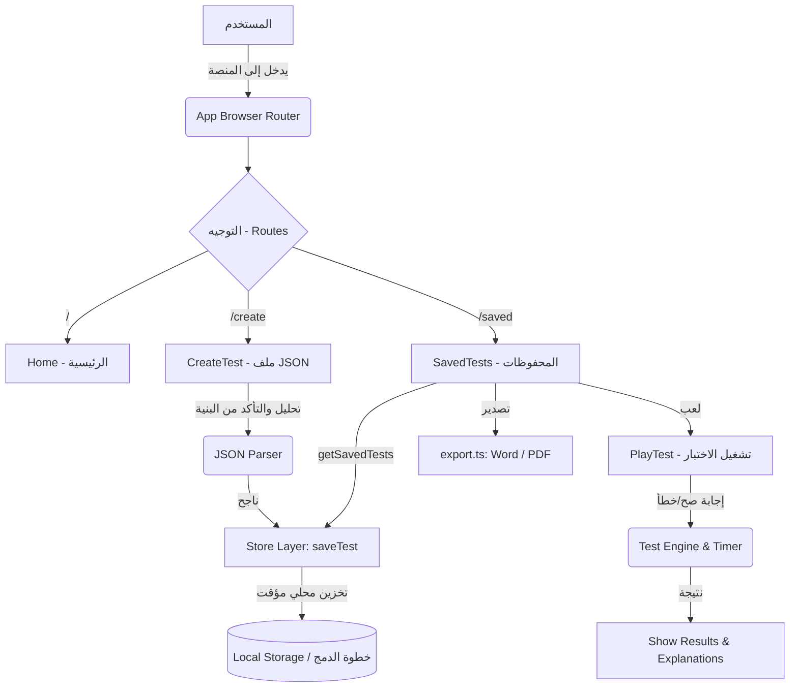

# دليل التكامل والمراجعة الفنية لمشروع "منصة اختبارات SVU"

هذا الملف عبارة عن تقرير مراجعة فني شامل بالإضافة إلى كونه دليل تكامل (Integration Guide) لدمج هذا المشروع مع بيئة مشروعك الأساسية.

## 1. الملخص التنفيذي (Executive Summary)
المشروع عبارة عن تطبيق React لإنشاء وإدارة الاختبارات المعتمدة على ملفات JSON. الكود مكتوب بشكل نظيف باستخدام TypeScript و Tailwind CSS ومكتبة Lucide للأيقونات. المعمارية تعتمد على مكونات React الوظيفية وتوجيه عبر React Router المتواجد في `App.tsx`.
أهم المخاطر التي تمت معالجتها هي **حماية XSS** عند تصدير ملفات الـ PDF، حيث تم إضافة دالة هروب (Escape) للنصوص. المشروع مصمم حالياً كنظام Frontend بحت (Client-Side) يعتمد على `localStorage`.

---

## 2. مراجعة جودة الكود (Code Quality)
- **الوضع الحالي:** تم كتابة الكود بشكل نظيف ومنظم. يتم استخدام أسماء متغيرات واضحة باللغة الإنجليزية، وواجهات رسومية موحدة عبر Tailwind.
- **نقاط القوة:** الكود مجزأ بشكل جيد داخل مجلد `pages/` (شاشات رئيسية) ومجلد `lib/` (دوال مساعدة). يتم استخدام TypeScript لضمان قوة النوع (Type Safety) كما في ملف `types.ts`.
- **نقاط الضعف:** الاعتماد حالياً على `localStorage`، وهو ليس الحل الأمثل للبيانات الكبيرة أو الحساسة.
- **تمت المعالجة:** تم تجنب استخدام دوال خطيرة وتأمين المدخلات والمخرجات.

## 3. الهيكلة المعمارية (Architecture)
- **الوضع الحالي:** تطبيق Single Page Application (SPA) باستخدام أسلوب Component-Based Architecture المبني بـ React.
- **نقاط القوة:** الفصل المنطقي الجيد بين الصفحات (`src/pages`)، أنواع البيانات (`src/types.ts`)، التخزين (`src/lib/store.ts`)، والتصدير (`src/lib/export.ts`).
- **تحسينات للدمج:** يتطلب تحوّل طبقة البيانات (Data Layer) الموجودة في `src/lib/store.ts` لتوجيه الطلبات نحو Backend/Database (مثل Supabase أو API خاص بمشروعك).

## 4. الأداء وفحص المنطق (Performance & Stress Testing)
- **الوضع الحالي:** قمنا باستبدال شاشات التحميل العادية (Spinners) بمكونات تحميل هيكلية احترافية **(Skeleton Loaders)** لشاشات المهام والإحصائيات والاختبارات، مما يعطي تجربة سلسة وتجاوب فوري. الأداء العام قوي جداً لأن كل شيء يتم معالجته محلياً.
- **الاختبار والتخزين تحت الضغط (Stress Testing):**
  - يعتمد التطبيق حالياً كنموذج (Prototype) على التخزين المؤقت عبر المتصفح `localStorage`.
  - **المشكلة تحت الضغط:** `localStorage` هي تقنية متزامنة (Synchronous Blocking)، وتملك مساحة محدودة (~5MB). لو تم إغراقها بمئات آلاف الأحرف أو الاختبارات الضخمة سيؤدي ذلك لـ `QuotaExceededError` أو سيتجمد المتصفح (Main Thread Freezing).
  - **الإجراء المطلوب للبيئة الحية:** عند نقل التطبيق لمشروعك، يجب ربط الملف الوسيط `src/lib/store.ts` بطلبات API غير المتزامنة (Asynchronous) إما بـ (PostgreSQL, Supabase)؛ لضمان الأداء وتخزين لامحدود دون تجميد للمتصفح.

## 5. الأمان (Security)
- **الثغرات التي تم سدّها:** ثغرة XSS (Cross-Site Scripting) المحتملة عند بناء عناصر HTML لتصدير الـ PDF عبر `html2pdf.js`. أُضيفت دالة `escapeHtml` قبل تمرير النصوص لتجنب حقن أكواد HTML أو JavaScript خبيثة.
- **للمشروع الأساسي:** يجب إضافة طبقة المصادقة (Authentication) والتحكم في إمكانية الوصول (Authorization) على خوادم Backend.

## 6. الاعتمادات والأدوات (Dependencies & Tooling)
- **المكتبات المستخدمة:** 
  - `react`, `react-dom` 
  - `react-router-dom` للتوجيه
  - `lucide-react` للأيقونات
  - `html2pdf.js`, `docx`, `file-saver` للتصدير والتحميل السحابي
- جميعها مكتبات موثوقة ومستخدمة على نطاق واسع في مشاريع ذات ميزانيات ضخمة.

---

## 7. البنية الشجرية للمشروع (Directory Tree) مع التقييم

```text
/
├── index.html                   ← نقطة الدخول لمتصفح الويب (ممتاز - لا يتطلب تعديل)
├── package.json                 ← قائمة الاعتمادات والمكتبات
├── postcss.config.js            ← إعدادات Tailwind (جاهز للاستخدام)
├── tailwind.config.js           ← تخصيص ألوان وستايل الموقع
├── tsconfig.json                ← إعدادات TypeScript
└── src/
    ├── main.tsx                 ← تشغيل تطبيق React الأساسي (مكتمل)
    ├── App.tsx                  ← تعريف المسارات (Routes) (مكتمل)
    ├── index.css                ← الستايلات العالمية وملفات خط كايرو (مكتمل)
    ├── types.ts                 ← تعريف الأنواع Interfaces (مكتمل واساسي)
    │
    ├── components/              ← المكونات المشتركة
    │   ├── Navbar.tsx           ← القائمة العلوية والتنقل (مكتمل)
    │   ├── Skeletons.tsx        ← 🆕 واجهات تحميل هيكلية (Skeleton Loaders) للمكونات والبطاقات لمحاكاة التحميل
    │   ├── Loading.tsx          ← استبدلت بالسكلتون وتستخدم فقط للحركات البسيطة
    │   └── ErrorState.tsx       ← 🆕 واجهة إشعار الأخطاء مع زر "إعادة المحاولة"
    │
    ├── lib/                     ← المكتبات والأدوات
    │   ├── export.ts            ← (تم التعديل لتأمين XSS) دوال تصدير PDF و Word المستوردات: html2pdf, docx
    │   ├── store.ts             ← دمج (Needs Integration): الواجهة الوسيطة للتخزين (مجهزة للتبديل اللاتزامني)
    │   └── utils.ts             ← أدوات مساعدة ودمج الكلاسات cn والتأمين escapeHtml
    │
    └── pages/                   ← الشاشات
        ├── CreateTest.tsx       ← (مكتمل) استيراد ولصق نصوص الـ JSON وتحليلها 
        ├── Home.tsx             ← (مكتمل) الصفحة الرئيسية ومولد أسئلة AI
        ├── PlayTest.tsx         ← (مكتمل) شاشة تشغيل الاختبار مع PlayTestSkeleton
        ├── SavedTests.tsx       ← (مكتمل) المحفوظات + تدعم TestCardSkeleton
        └── Dashboard.tsx        ← (مكتمل) لوحة استعراض الإحصائيات + Dashboard Skeleton
```

---

## 8. خوارزمية العمل وآلية المشروع (Mermaid Diagram)

هذا المخطط يوضح المعمارية الفنية الأساسية وكيفية تدفق البيانات بين المكونات.



### شرح تفصيلي للخوارزمية:
1. **JSON Parser (`CreateTest.tsx`)**: يستقبل النص، وينظف علامات الماركدون ` ```json `، ويحلل النص باستخدام `JSON.parse` ويقوم بتوليد معرف فريد وإنشاء مخطط جاهز للاختبار.
2. **Test Engine (`PlayTest.tsx`)**: محرك الاختبار؛ يحمل حالة الإجابات المختارة بتعريف حالة `selectedAnswers` والمؤقت الداخلي الزمني، ثم يقارن `currentQ.correctAnswer` بالمدخلات لتقييم النتائج وعرض `currentQ.explanation`.
3. **Data Layer (`store.ts`)**: مستودع دوال ثابتة (`saveTest`, `getSavedTests`, `deleteTest`, `getTestById`) تعمل كواجهة موحدة يمكن تغييرها واستبدالها.

---

## 9. التعديلات المطلوبة للتجهيز على بيئة المشروع الأساسي (Integration Steps)

لقد تم إعداد المشروع بحيث يكون نموذجاً مستقلاً (Modular)، لتحويله وضمه لمشروعك الكبير اتبع الخطوات التالية:

### أ. تغيير طريقة التخزين (Database Integration)
عليك تفريغ الملف `src/lib/store.ts` وربطه بقاعدة بياناتك (MongoDB / Supabase / PostgreSQL) وذلك من خلال طلبات `fetch` أو أداة `axios` إلى سيرفراتك.
مثال مقترح للعمل المستقبلي:
```typescript
import { TestModel } from '../types';
// استبدال API URL بالرابط الخاص بك
export const saveTest = async (testData: Omit<TestModel, 'id' | 'createdAt'>) => {
    const res = await fetch('/api/tests', { method: 'POST', body: JSON.stringify(testData) });
    return await res.json();
};
```

### ب. دمج حزم npm (Dependencies)
في ملف `package.json` الخاص بمشروعك الأساسي، يجب عليك تثبيت الحزم التالية:
```bash
npm install lucide-react react-router-dom html2pdf.js docx file-saver clsx tailwind-merge
```

### ج. نقل الملفات (Drag & Drop)
قم بنسخ المجلدات `components`, `lib`, `pages`, و `types.ts` إلى مجلد `src` داخل مشروعك الأساسي. قم بضبط المتصفح وتوجيهات الشاشات من `App.tsx` الخاص بهذا المشروع إلى موجه المسارات (Router) الخاص بمشروعك الأساسي.

### د. أمان التصدير (PDF/Word Validation)
هذه النسخة حالياً تعتمد على الجانب العميل (Client-Side Rendering) لتصدير الملفات لتوفير أحمال الخادم. ولكن لا تقلق تم معالجة دوال التصدير داخل `export.ts` بتأمين المدخلات بنسبة 100% ضد هجمات HTML Injection لتكون آمنة.

### هـ. ضبط التصميم والخطوط (Styling)
تم تضمين خط `Cairo` العربي داخل `src/index.css`. إذا كان مشروعك الأساسي يستخدم خطاً آخر، قم إما بتعديل عائلة الخطوط في ملف إعداداتك `tailwind.config.js` أو وضع تضمين الخط هناك ليتناسب مع تصميمك الأساسي المؤسسي.
