# مخطط الواجهة

## الهدف
توثيق مخطط Frontend للمشروع الحالي داخل `src`.

## المخطط العام

```mermaid
graph TD
  A[main.tsx] --> B[App.tsx]
  B --> C[QueryClientProvider]
  B --> D[AuthProvider]
  B --> E[BrowserRouter]
  B --> F[GuestProvider]
  E --> F1[ErrorBoundary]
  F1 --> G[Routes]

  G --> H[Home]
  G --> I[Login]
  G --> J[Register]
  G --> K[AuthCallback]
  G --> L[Dashboard via GuestRoute]
  G --> M[Exam via GuestRoute + ExamLayout]
  G --> N[NotFound]

  L --> O[DashboardPage]
  M --> M1[ExamHome]
  M --> M2[CreateTest]
  M --> M3[SavedTests]
  M --> M4[PlayTest]

  H --> P[Navbar]
  H --> Q[HeroAddition]
  H --> R[LandingSections]
  H --> S[Footer]

  R --> R1[ProblemsSection]
  R --> R2[SolutionBridge]
  R --> R3[FeaturesSection]
  R --> R4[HowItWorksSection]
  R --> R5[ComingSoonSection]
  R --> R6[FinalCTASection]

  R3 --> T[InteractiveMapSimulation]

  I --> U[AuthCard]
  I --> V[InputField]
  I --> W[ForgotPasswordModal]
  I --> X[AuthButton]

  J --> U
  J --> V
  J --> X

  O --> Y[DashboardLayout]
  O --> Z[DashboardHeader]
  O --> AA[EmptyDashboardState]
  AA --> AA1[StudyGroupsCard]
  AA --> AA2[CourseMaterialsCard]
  AA --> AA3[ScheduleExtractionCard]
  AA --> AA4[TestsCard]
  O --> AB[SettingsModal]
  O --> AC[LogoutModal]
  O --> AD[DeleteAccountModal]

  AB --> AE[ProfileSettingsForm]
  AB --> AF[SecuritySettingsForm]

  style M fill:#1e293b
  style M1 fill:#1e293b
  style M2 fill:#1e293b
  style M3 fill:#1e293b
  style M4 fill:#1e293b
```

## الملاحظات المهمة

- `App.tsx` هو نقطة دخول الواجهة.
- `AuthProvider` موجود في `contexts/AuthContext.tsx`.
- `GuestProvider` موجود في `contexts/GuestContext.tsx`.
- `GuestRoute` يسمح بالدخول إلى `/dashboard` بدون جلسة (يدعم وضع الزائر).
- بعد تسجيل الدخول، الزائر يصبح مُسجِّلاً ولا يفرق أي فرق في Rendering.
- `ProtectedRoute` غير موصول في `App.tsx` حالياً — **محجوز لميزة المجموعات (Study Groups) المستقبلية** التي ستكون للمُسجّلين فقط.
- Exam feature ($`features/exam/`$) ميزة مستقلة كاملة بمساراتها الخاصة.
- `Home` يجمع كل أجزاء الصفحة الرئيسية.
- `Dashboard` فيه shell مكتمل مع 4 بطاقات ميزات (placeholder).
