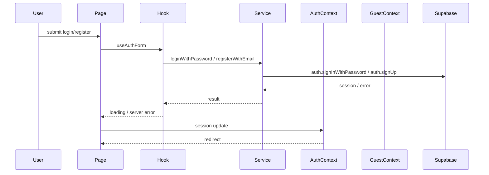

# Auth Flow Diagram

## مكونات المصادقة

| المكون | الحالة |
|---|---|
| `AuthContext` | نشط |
| `GuestContext` | نشط |
| `GuestRoute` | **نشط** — يُستخدم في App.tsx |
| `ProtectedRoute` | **محجوز** — لميزة المجموعات |

## ملاحظات

- `AuthContext` هو مركز حالة المصادقة.
- `GuestRoute` يعتمد على `AuthContext` + `GuestContext`.
- `src/services/auth.service.ts` هو الخدمة الرئيسية للمصادقة.
- `src/lib/supabase.ts` يحتوي على دوال legacy بجانب `getSupabaseClient`.
- `loginSchema` يسمح بـ 6 أحرف، بينما `registerSchema` يطلب 8 أحرف.
