# Component Tree

```mermaid
graph TD
  A[App]
  A --> B[Home]
  A --> C[Login]
  A --> D[Register]
  A --> E[AuthCallback]
  A --> F[Dashboard via GuestRoute]
  A --> G[Exam via GuestRoute + ExamLayout]
  G --> G1[ExamHome]
  G --> G2[CreateTest]
  G --> G3[SavedTests]
  G --> G4[PlayTest]
  A --> H[NotFound]

  B --> I[Navbar]
  B --> J[HeroAddition]
  B --> K[LandingSections]
  B --> L[Footer]

  K --> M[ProblemsSection]
  K --> N[SolutionBridge]
  K --> O[FeaturesSection]
  K --> P[HowItWorksSection]
  K --> Q[ComingSoonSection]
  K --> R[FinalCTASection]

  O --> S[InteractiveMapSimulation]

  C --> T[AuthCard]
  C --> U[InputField]
  C --> V[ForgotPasswordModal]
  C --> W[AuthButton]

  D --> T
  D --> U
  D --> W

  F --> X[DashboardLayout]
  F --> Y[DashboardHeader]
  F --> Z[EmptyDashboardState]
  Z --> Z1[StudyGroupsCard]
  Z --> Z2[CourseMaterialsCard]
  Z --> Z3[ScheduleExtractionCard]
  Z --> Z4[TestsCard]
  F --> AA[SettingsModal]
  F --> AB[LogoutModal]
  F --> AC[DeleteAccountModal]

  AA --> AD[ProfileSettingsForm]
  AA --> AE[SecuritySettingsForm]

  style G fill:#1e293b
  style G1 fill:#1e293b
  style G2 fill:#1e293b
  style G3 fill:#1e293b
  style G4 fill:#1e293b
```

## Notes

- `GuestRoute` is the active route guard for all public routes.
- `ProtectedRoute` is **not wired in App.tsx** — reserved for the future **Study Groups** feature (registered users only, no guests).
- Exam feature is self-contained under `features/exam/`.
- `src/stories` is not part of the production tree.
