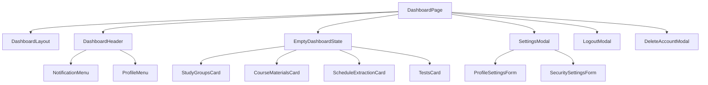

# Dashboard Flow Diagram

## Notes

- Dashboard shell is present and functional.
- EmptyDashboardState now renders 4 feature cards via separate components.
- Guest mode short-circuits notifications in guest mode.
- `notificationStore` is unused.
