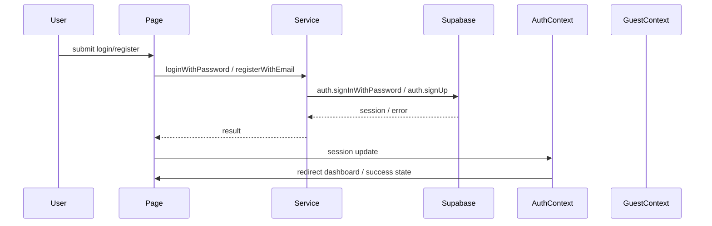
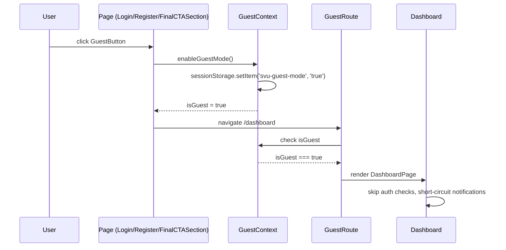
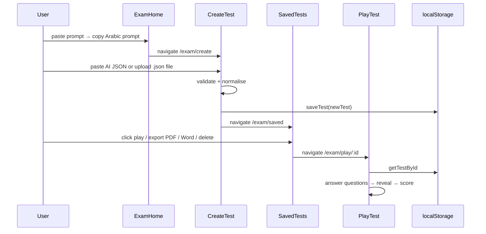

# Auth Flow

## المخطط

## المكونات المشاركة

- `LoginPage`
- `RegisterPage`
- `AuthCard`
- `InputField`
- `useAuthForm`
- `useRateLimit`
- `auth.service.ts`
- `AuthContext.tsx`
- `GuestContext.tsx`
- `GuestRoute.tsx` (نشط — يُستخدم في App.tsx)
- `ProtectedRoute.tsx` (محجوز — لميزة المجموعات)

## الخدمات

### `loginWithPassword`
- الملف: `src/services/auth.service.ts`
- الوظيفة: تسجيل الدخول بالبريد وكلمة المرور.

### `registerWithEmail`
- الملف: `src/services/auth.service.ts`
- الوظيفة: إنشاء حساب جديد.

### `loginWithGoogle`
- الملف: `src/services/auth.service.ts`
- الوظيفة: تسجيل الدخول عبر Google.

### `resetPassword`
- الملف: `src/services/auth.service.ts`
- الوظيفة: إعادة تعيين كلمة المرور.

### `completeAuthCallback`
- الملف: `src/services/auth.service.ts`
- الوظيفة: إكمال الجلسة بعد redirect.

### `enableGuestMode` / `disableGuestMode`
- الملف: `src/contexts/GuestContext.tsx`
- الوظيفة: تفعيل/إيقاف وضع الزائر.
- يخزن الحالة في `sessionStorage` تحت المفتاح `svu-guest-mode`.
- يستخدمه `GuestRoute` و `GuestButton`.

## Guest Flow

## Exam Feature Flow

## Route Guards

### GuestRoute (نشط)
- الملف: `src/components/GuestRoute.tsx`
- يُستخدم لـ: `/dashboard` + جميع `/exam/*`
- يقبل: المُسجِّل + الزائر (Guest Mode)
- يمنع: المستخدمين بدون جلسة وبدون تفعيل Guest Mode

### ProtectedRoute (محجوز)
- الملف: `src/components/ProtectedRoute.tsx`
- لم يُوصل في `App.tsx` بعد
- الغرض: ميزة **المجموعات (Study Groups)** المستقبلية — للمُسجِّلين فقط
- يمنع: الزوار (Guest Mode)

## Auth Context

- الملف: `src/contexts/AuthContext.tsx`
- المسؤول: إدارة جلسة Supabase (`session`, `loading`, `signIn`, `signUp`, `signOut`)

## Guest Context

- الملف: `src/contexts/GuestContext.tsx`
- المكونات المستخدمة:
  - `GuestProvider`
  - `useGuest`
- المكونات المستهلكة:
  - `GuestRoute`
  - `GuestButton`
  - `useDashboardNotifications`
  - `DashboardHeader`
  - `ProfileMenu`

## ملاحظات

- وضع الزائر يسمح بالوصول إلى `/dashboard` بدون تسجيل دخول.
- لا يتم استدعاء أي API عند تفعيل وضع الزائر.
- تنبيهات الإشعارات تعمل في وضع placeholder في Guest Mode.
- `GuestButton` موجود في `src/components/shared/GuestButton.tsx` ويستخدم `motion.button`.
- `AuthProvider` يستدعي `completeAuthCallback`.
- `AuthCallback` الصفحة تستدعي نفس العملية أيضاً — قد يؤدي إلى تكرار `upsertProfile`.
- `loginSchema` يسمح بـ 6 أحرف، بينما `registerSchema` يطلب 8 أحرف.
- `ProtectedRoute` غير موصول حالياً — يحتاج إنشاء ميزة المجموعات أولاً.
