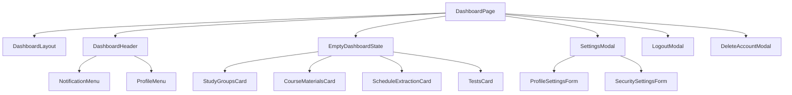

# Dashboard Flow

## المخطط

## الحالة الحالية

- Dashboard shell موجود ومكتمل.
- Header موجود مع NotificationMenu + ProfileMenu.
- Settings modal موجود.
- Logout modal موجود.
- Delete account modal موجود.
- `EmptyDashboardState` يعرض حالياً 4 بطاقات ميزات (placeholder).
- `GuestRoute` هو الحارس النشط لـ `/dashboard` — يقبل المُسجِّل والزائر.
- `ProtectedRoute` غير موصول — محجوز لميزة المجموعات المستقبلية.
- `notificationStore` و `uiStore` موجودان لكن غير مستخدمين حالياً.
- `TanStack Query` مهيأ لكن لا يستخدم فعلياً لجلب البيانات.

## التدفق

1. المستخدم يدخل `/dashboard`.
2. `GuestRoute` يتحقق:
   - إذا كانت هناك جلسة Supabase → يسمح.
   - إذا كان `isGuest = true` (من sessionStorage) → يسمح.
   - وإلا → يعيد التوجيه إلى `/login`.
3. `DashboardPage` تُعرض مع `EmptyDashboardState`.
4. `useDashboardNotifications`:
   - في Guest Mode → no API call (short-circuit).
   - في Logged-in Mode → fetch from Supabase.
5. المستخدم يستطيع فتح:
   - notifications (placeholder in guest mode)
   - settings (logged-in only)
   - logout
   - delete account

## ملاحظات

- لا توجد واجهة فعلية للمجموعات بعد — Cards هي placeholders.
- ميزة الاختبارات (Exam) موجودة بشكل منفصل تحت `/exam/*` ولا تمر عبر Dashboard.
- ميزة المجموعات (Study Groups) ستُضاف مستقبلاً وستكون محمية بـ `ProtectedRoute`.
