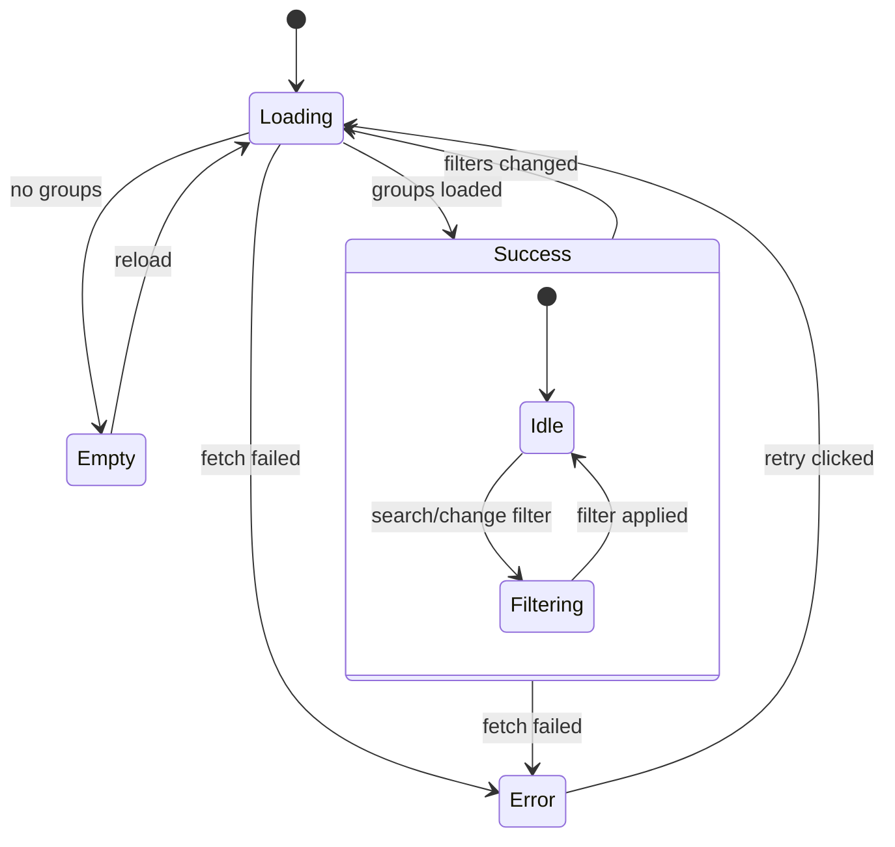
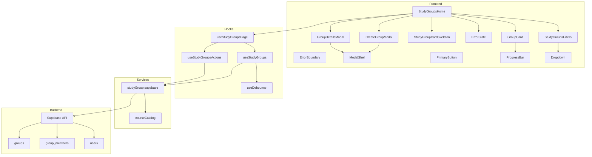
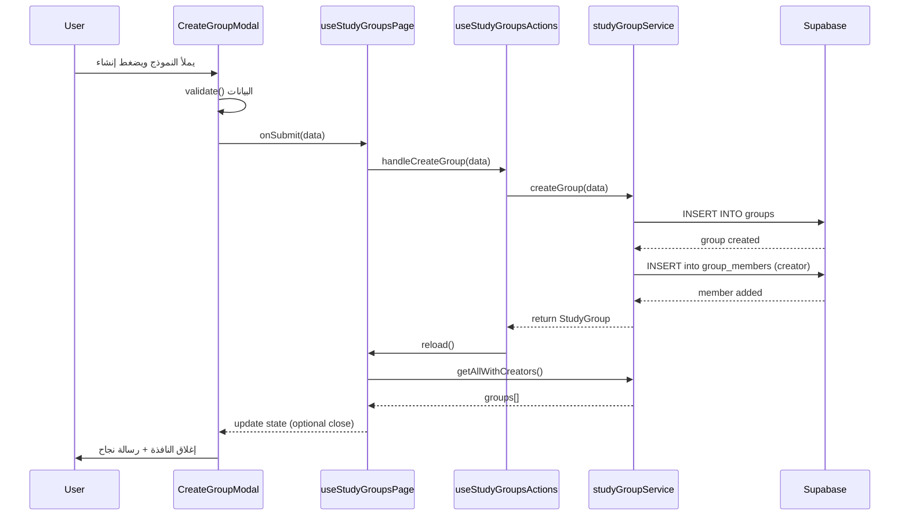
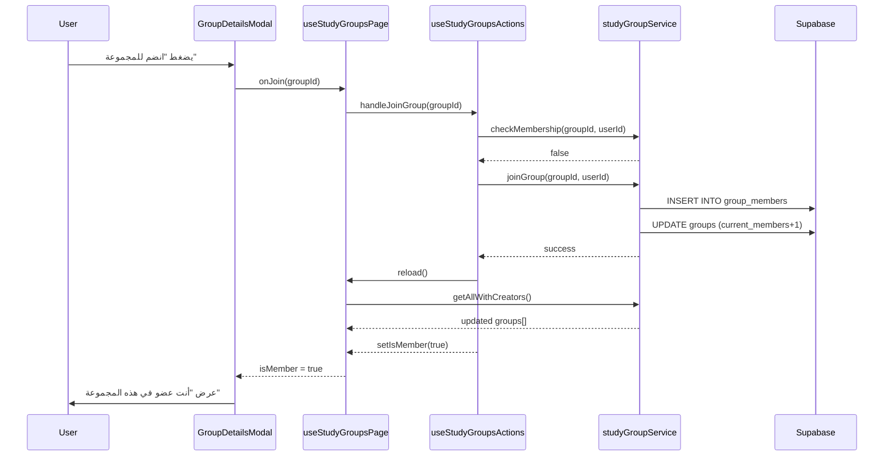
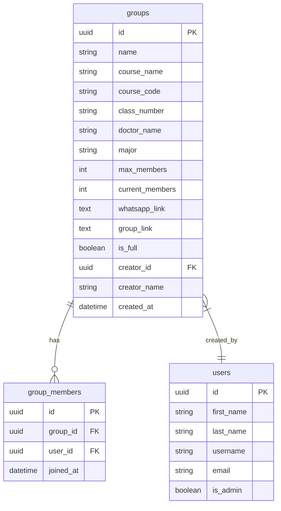
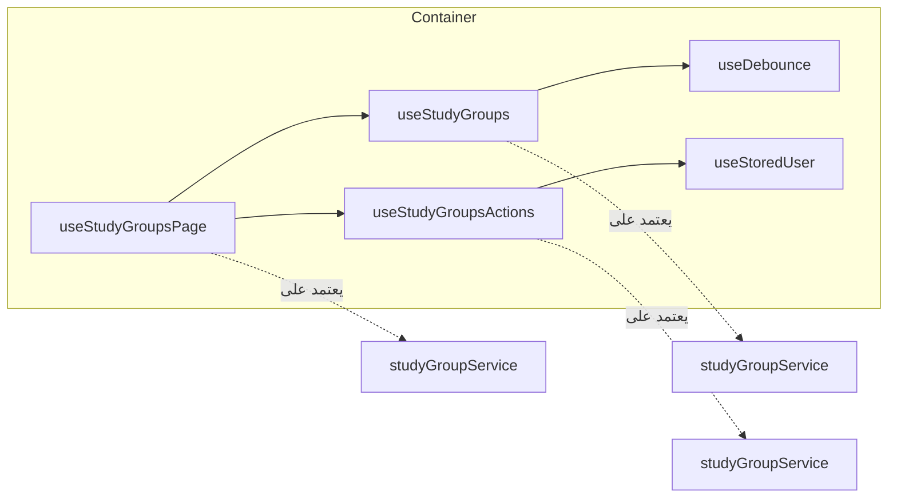
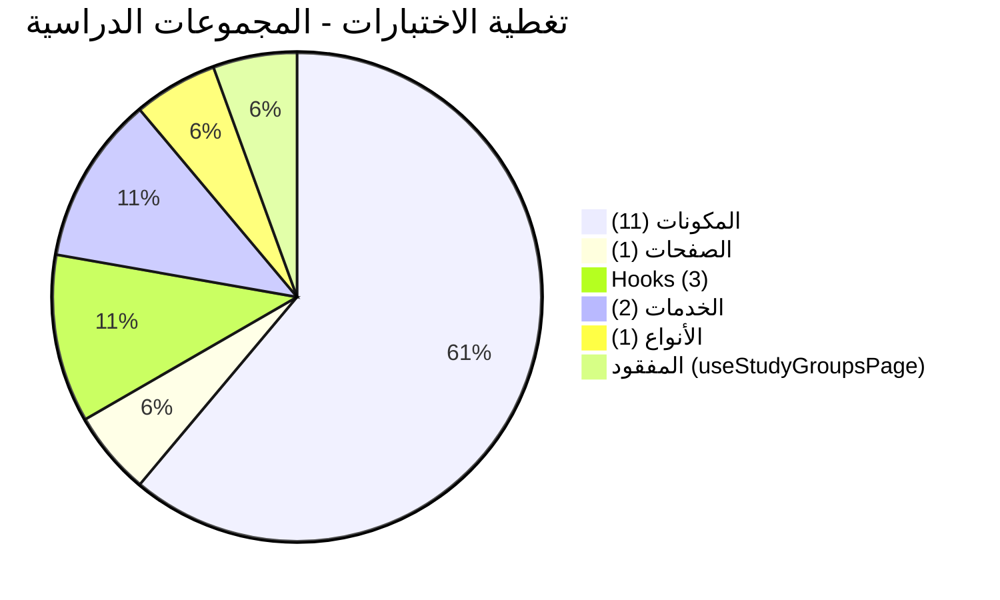
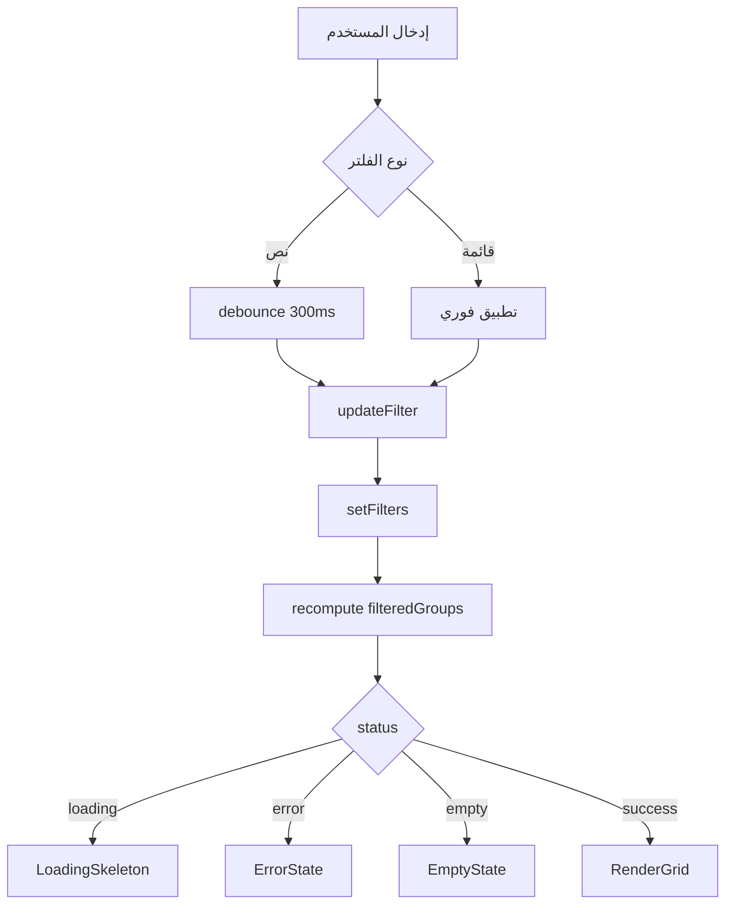
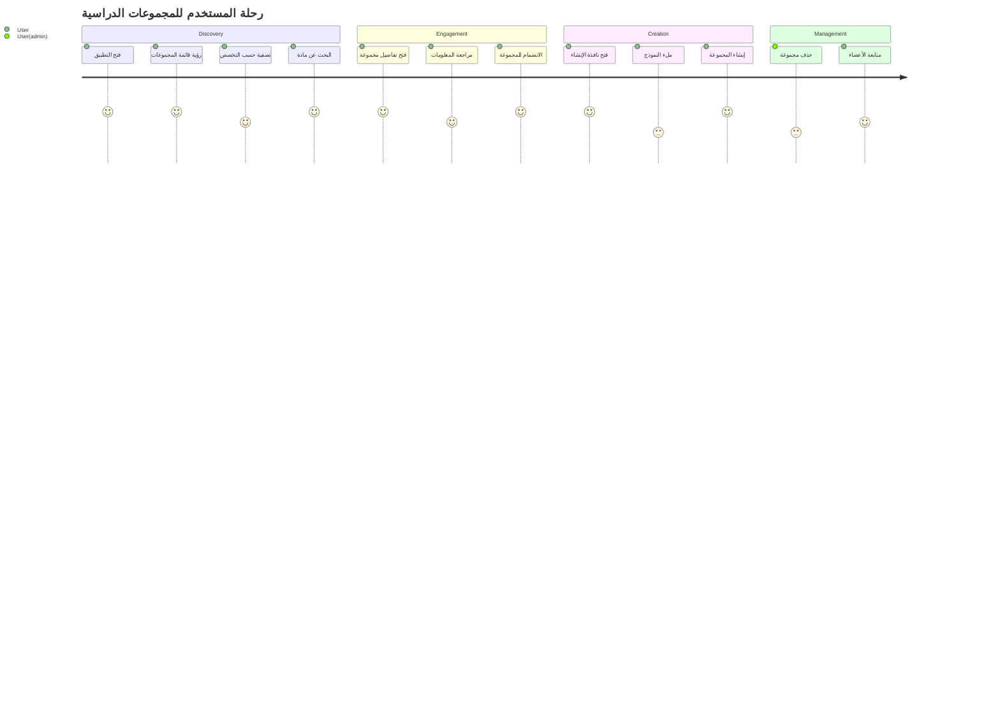
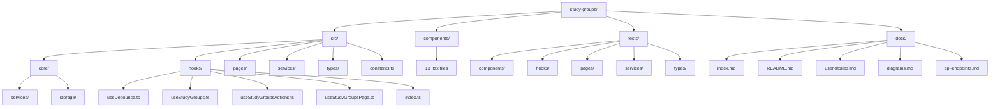

# مخططات UML - المجموعات الدراسية

## 1. مخطط الحالات (State Diagram)



## 2. مخطط الفصل (Component Diagram)



## 3. مخطط التسلسل - إنشاء مجموعة (Create Group)



## 4. مخطط التسلسل - الانضمام لمجموعة



## 5. مخطط البيانات (Entity Relationship)



## 6. مخطط تدفق المستخدم - المجموعات

```mermaid
flowchart TD
  Start([البداية]) --> Load[تحميل المجموعات]
  Load --> CheckAuth{مستخدم مسجل؟}
  CheckAuth -->|لا| AuthError[خطأ مصادقة]
  CheckAuth -->|نعم| FetchGroups[إحضار المجموعات]

  FetchGroups --> CheckLoading{جاري التحميل؟}
  CheckLoading -->|نعم| ShowSkeleton[عرض 8 skeletons]
  CheckLoading -->|لا| CheckError{هناك خطأ؟}

  CheckError -->|نعم| ShowError[عرض رسالة خطأ]
  CheckError -->|لا| CheckEmpty{مجموعات فارغة؟}

  CheckEmpty -->|نعم| ShowEmpty[عرض "لا توجد مجموعات"]
  CheckEmpty -->|لا| RenderGrid[عرض شبكة البطاقات]

  ShowSkeleton --> Wait[انتظار]
  Wait --> FetchGroups

  ShowError --> Retry[إعادة المحاولة]
  Retry --> FetchGroups

  ShowEmpty --> CreateBtn[زر إنشاء مجموعة]
  CreateBtn --> OpenCreateModal[فتح نافذة الإنشاء]

  RenderGrid --> ClickCard[نقر على بطاقة]
  ClickCard --> OpenDetails[فتح نافذة التفاصيل]

  OpenCreateModal --> SubmitForm[إرسال النموذج]
  SubmitForm --> Validate{صحيح؟}
  Validate -->|لا| ShowErrors[عرض أخطاء]
  Validate -->|نعم| CreateGroup[إنشاء المجموعة]
  CreateGroup --> CloseModal[إغلاق + إعادة تحميل]

  OpenDetails --> CheckMember{عضو؟}
  CheckMember -->|نعم| ShowMember[عرض "عضو"]
  CheckMember -->|لا| ShowJoin[عرض زر انضمام]

  ShowJoin --> JoinClick[نقر انضم]
  JoinClick --> ConfirmJoin{تأكيد؟}
  ConfirmJoin -->|نعم| JoinGroup[الانضمام]
  ConfirmJoin -->|لا| Close
  JoinGroup --> Close[إغلاق]
```

## 7. مخطط Hooks - التبعيات



## 8. مخطط اختبار التغطية



## 9. حالات الفلترة



## 10. خريطة رحلة المستخدم (User Journey)



## 11. مخطط بنية الملفات



---

**ملاحظة:** كل المخططات بصيغة Mermaid ويمكن عرضها في GitHub أو أي أداة تدعم Mermaid.
