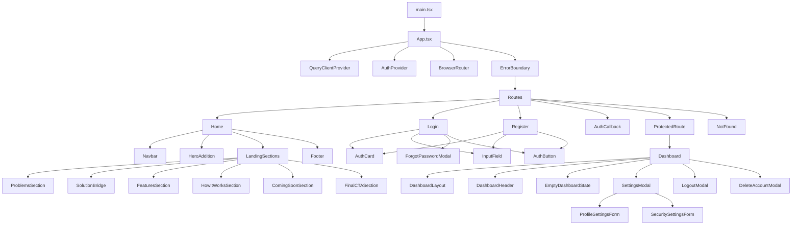

# مخطط الواجهة

## الهدف

توثيق مخطط Frontend للمشروع الحالي داخل `src`.

## المخطط العام

## الملاحظات المهمة

- `App.tsx` هو نقطة دخول الواجهة.
- `AuthProvider` موجود داخل `contexts/AuthContext.tsx`.
- `ProtectedRoute` يحمي `/dashboard`.
- `Home` يجمع كل أجزاء الصفحة الرئيسية.
- `Dashboard` لا يزال عبارة عن shell إلى حد كبير.
- `src/stories` مخصص لـ Storybook فقط ولا يجب أن يستورده أي كود إنتاجي.
