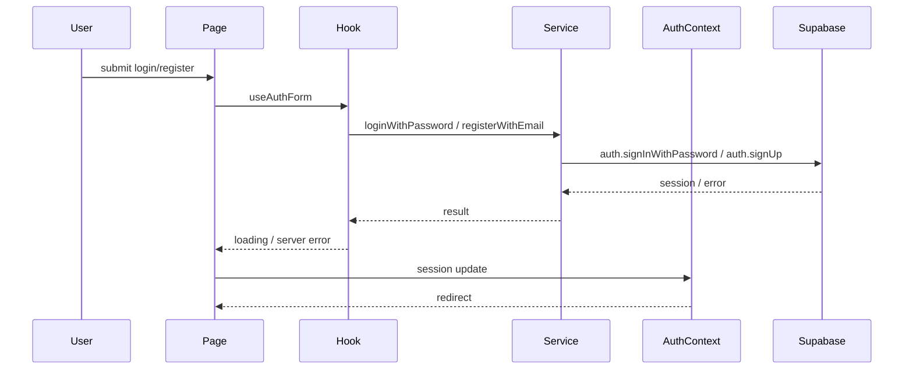

# Auth Flow Diagram

## Notes

- `AuthContext` is the central auth state holder.
- `ProtectedRoute` depends on `AuthContext`.
- `src/services/auth.service.ts` is the main auth service.
- `src/lib/supabase.ts` still has legacy auth helpers.
