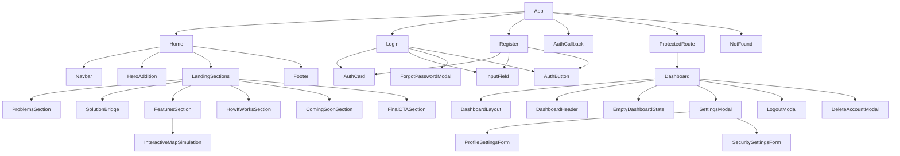

# Component Tree

## Notes

- `src/components/ui` contains low-level reusable pieces.
- `src/components/landing` contains the landing page sections.
- `src/components/dashboard` contains dashboard-specific modals and forms.
- `src/pages` contains page-level orchestration.
- `src/stories` is not part of the production tree.
