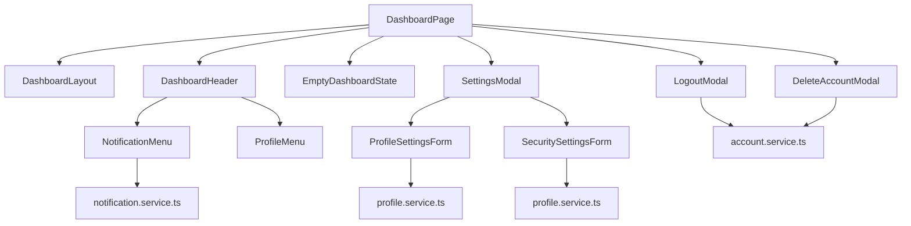

# Dashboard Flow Diagram

## Notes

- Dashboard is structurally present but functionally sparse.
- Notifications are fetched manually, not via TanStack Query.
- `EmptyDashboardState` is still a placeholder.
- `notificationStore` and `uiStore` are unused.
