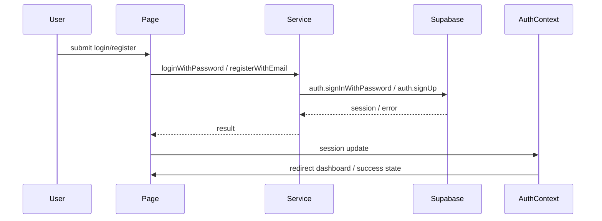

# Auth Flow

## المخطط

## المكونات المشاركة

- `LoginPage`
- `RegisterPage`
- `AuthCard`
- `InputField`
- `useAuthForm`
- `useRateLimit`
- `auth.service.ts`
- `AuthContext.tsx`
- `ProtectedRoute.tsx`

## الخدمات

### `loginWithPassword`
- الملف: `src/services/auth.service.ts`
- الوظيفة: تسجيل الدخول بالبريد وكلمة المرور.

### `registerWithEmail`
- الملف: `src/services/auth.service.ts`
- الوظيفة: إنشاء حساب جديد.

### `loginWithGoogle`
- الملف: `src/services/auth.service.ts`
- الوظيفة: تسجيل الدخول عبر Google.

### `resetPassword`
- الملف: `src/services/auth.service.ts`
- الوظيفة: إعادة تعيين كلمة المرور.

### `completeAuthCallback`
- الملف: `src/services/auth.service.ts`
- الوظيفة: إكمال الجلسة بعد redirect.

## AuthContext

- الملف: `src/contexts/AuthContext.tsx`
- المسؤوليات:
  - حفظ `session`
  - حفظ `profile`
  - تتبع `loading`
  - تتبع `envMissing`
  - تحديث profile عند تغير الجلسة

## ملاحظات

- `AuthProvider` يستدعي `completeAuthCallback`.
- `AuthCallback` الصفحة تستدعي نفس العملية أيضاً.
- هذا قد يؤدي إلى تكرار `upsertProfile`.
- `loginSchema` يسمح بـ 6 أحرف، بينما `registerSchema` يطلب 8 أحرف.
