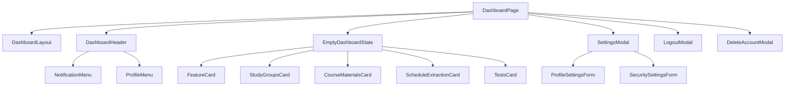

# Dashboard Flow

## المخطط

## الحالة الحالية

- Dashboard shell موجود.
- Header موجود.
- Notifications menu موجود.
- Profile menu موجود.
- Settings modal موجود.
- Logout modal موجود.
- Delete account modal موجود.
- `EmptyDashboardState` لا يزال فارغاً.

## التدفق

1. المستخدم يدخل `/dashboard`.
2. `ProtectedRoute` يتحقق من الجلسة.
3. إذا كانت الجلسة غير موجودة، يعيد التوجيه إلى `/login`.
4. إذا كانت الجلسة موجودة، يتم عرض `DashboardPage`.
5. `DashboardPage` تحمل notifications.
6. المستخدم يستطيع فتح:
   - notifications
   - settings
   - logout
   - delete account

## ملاحظات

- لا توجد واجهة فعلية للمجموعات أو المقررات.
- لا توجد لوحة نشاط أو جدول أو محتوى داخلي.
- `notificationStore` غير مستخدم.
- `TanStack Query` موجود لكن لا يستخدم في notifications.
